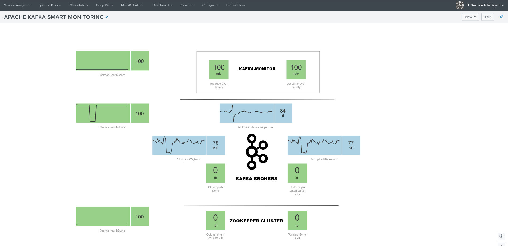
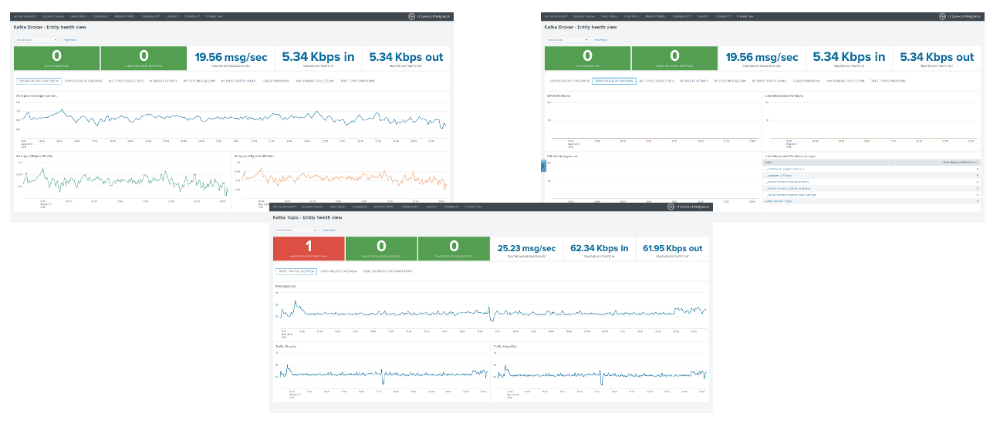

# Welcome to the ITSI module for Telegraf Apache Kafka smart monitoring

The ITSI module for Telegraf Kafka monitoring provides smart insight monitoring for Apache Kafka monitoring, on top of Splunk and ITSI.

The best components are leveraged together to bring the power of a solution with no equivalent on the market.

The ITSI provides builtin and native monitoring for Zookeeper, Kafka brokers, Kafka topics, Kafka Connect and end to end monitoring with the LinkedIn Kafka monitor.

The documentation is available on-line at: https://da-itsi-telegraf-kafka.readthedocs.io

The ITSI module for Apache Kafka end to end monitoring leverages the best components to provide a key layer monitoring for your Kafka infrastructure :

- Telegraf from Influxdata (https://github.com/influxdata/telegraf)
- Jolokia for the remote JMX collection over http (https://jolokia.org)
- Telegraf Jolokia2 input plugin (https://github.com/influxdata/telegraf/tree/master/plugins/inputs/jolokia2)
- Telegraf Zookeeper input plugin (https://github.com/influxdata/telegraf/tree/master/plugins/inputs/zookeeper)
- LinkedIn Kafka monitor to provide end to end monitoring (https://github.com/linkedin/kafka-monitor)

The ITSI module provides a native and builtin integration with Splunk and ITSI:

- Builtin entities discovery for Zookeeper servers, Kafka brokers, Kafka connect nodes, Kafka connect source and sink tasks, Kafka-monitor, Kafka topics
- Services templates and KPI base searches for Zookeeper, Kafka brokers, Kafka connect and source/sink tasks, Kafka LinkedIn monitor, Kafka topics
- Rich entity health views to manage Operating System metrics ingested in the Splunk metric store
