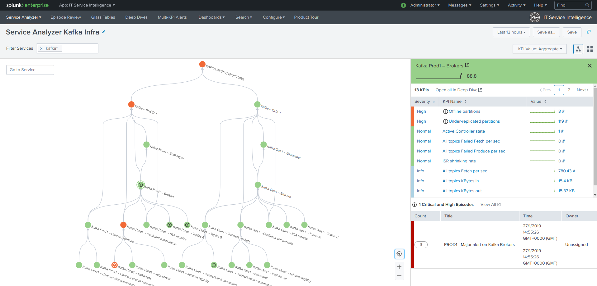

# ITSI modufle for Kafka Smart Monitoring for Splunk

| branch | build status |
| ---    | ---          |
| master | 

Copyright 2018-2019 Guilhem Marchand

Licensed under the Apache License, Version 2.0 (the "License");
you may not use this file except in compliance with the License.
You may obtain a copy of the License at

http://www.apache.org/licenses/LICENSE-2.0

Unless required by applicable law or agreed to in writing, software
distributed under the License is distributed on an "AS IS" BASIS,
WITHOUT WARRANTIES OR CONDITIONS OF ANY KIND, either express or implied.
See the License for the specific language governing permissions and
limitations under the License.

# Welcome to the ITSI module for Telegraf Apache Kafka smart monitoring

The ITSI module for Telegraf Kafka monitoring provides smart insight monitoring for Apache Kafka monitoring, on top of Splunk and ITSI.

The best components are leveraged together to bring the power of a solution with no equivalent on the market.

**The ITSI module for Telegraf Kafka monitoring provides smart insight monitoring for Apache Kafka monitoring, on top of Splunk and ITSI.**

On-line documentation: https://da-itsi-telegraf-kafka.readthedocs.io

**The ITSI module provides builtin and native monitoring for Apache Kafka components, as well as the Confluent stack components:**

- Zookeeper
- Apache Kafka Brokers
- Apache Kafka Connect
- Confluent schema-registry
- Confluent ksql-server
- Confluent kafka-rest
- Kafka SLA and end to end monitoring with the Linkedin Kafka monitor
- Kafka Consumers lag monitoring with Burrow (Kafka Connect connectors, Kafka Streams, etc.)

**Native ITSI integration:**

- Builtin entities discovery for all components
- Services templates and KPI base searches
- Rich entity health views for each component of your Kafka environment

Multi-tenancy is fully supported by the application, relying on metrics tags support.

READ THE UNIFIED GUIDE FOR KAFKA MONITORING: https://splunk-guide-for-kafka-monitoring.readthedocs.io
