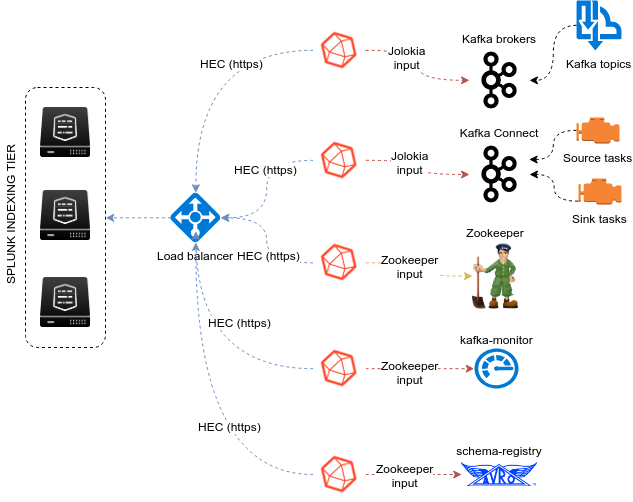

About
=====

* Author: Guilhem Marchand

* First release published in October 2018

* Purposes:

**The ITSI module for Apache Kafka end to end monitoring leverages the best components to provide a key layer monitoring for your Kafka infrastructure :**

* Telegraf from Influxdata (https://github.com/influxdata/telegraf)

* Jolokia for the remote JMX collection over http (https://jolokia.org)

* Telegraf Jolokia2 input plugin (https://github.com/influxdata/telegraf/tree/master/plugins/inputs/jolokia2)

* Telegraf Zookeeper input plugin (https://github.com/influxdata/telegraf/tree/master/plugins/inputs/zookeeper)

* LinkedIn Kafka monitor to provide end to end monitoring (https://github.com/linkedin/kafka-monitor)

**The ITSI module provides a native and builtin integration with Splunk and ITSI:**

- Builtin entities discovery for Zookeeper servers, Kafka brokers, Kafka connect nodes, Kafka connect source and sink tasks, Kafka-monitor, Kafka topics, Confluent schema-registry
- Services templates and KPI base searches for Zookeeper, Kafka brokers, Kafka connect and source/sink tasks, Kafka LinkedIn monitor, Kafka topics, Confluent schema-registry
- Rich entity health views to manage Operating System metrics ingested in the Splunk metric store

