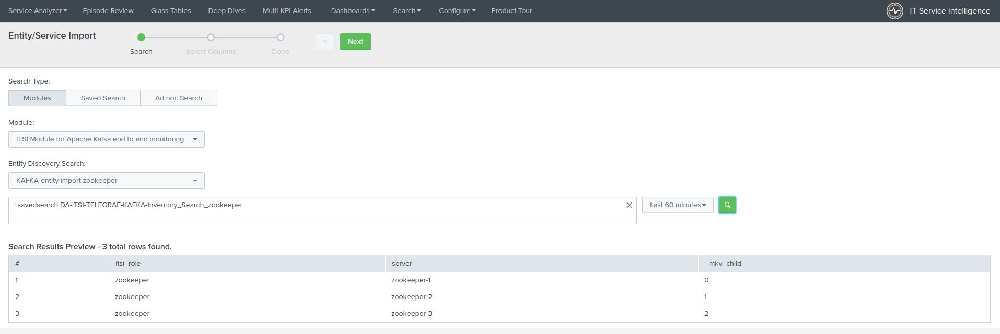
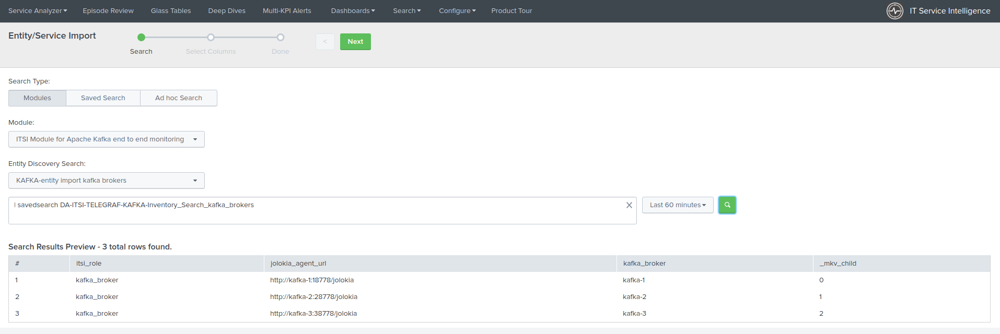
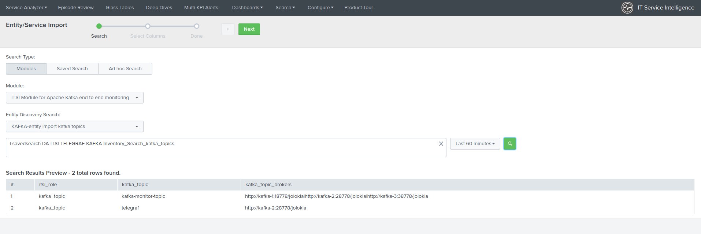
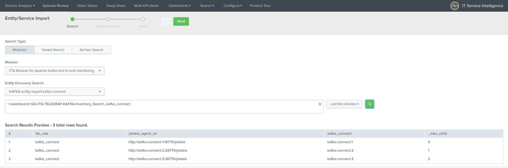
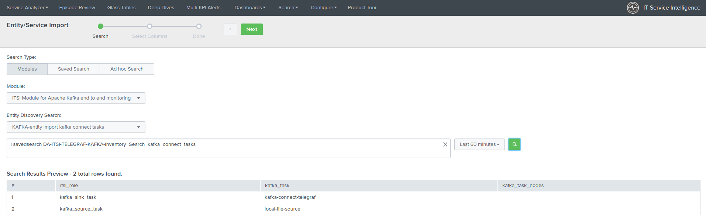
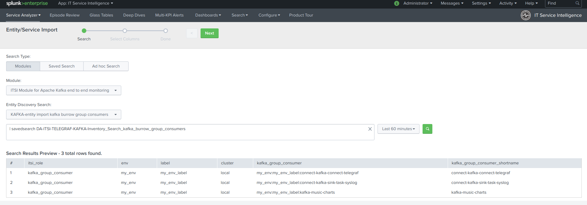
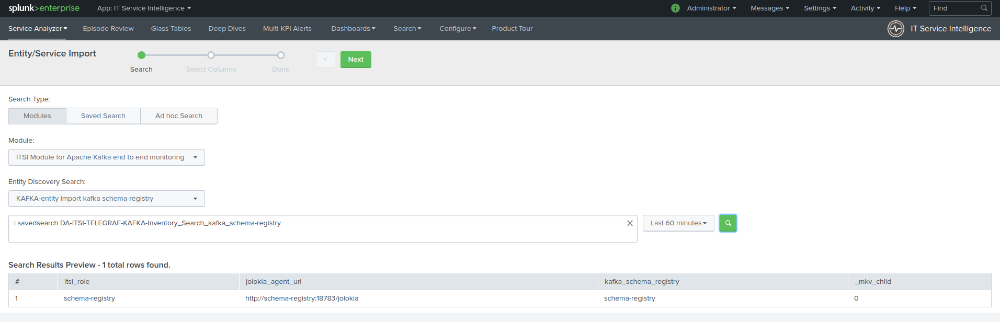
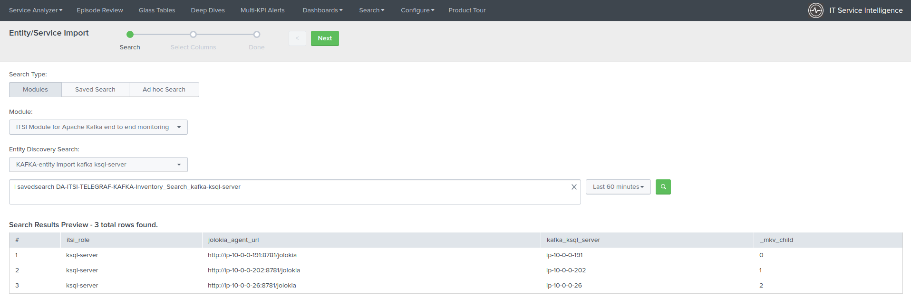
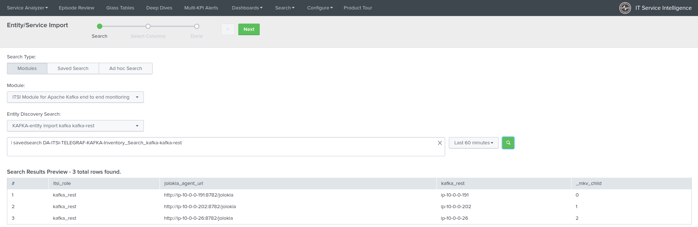
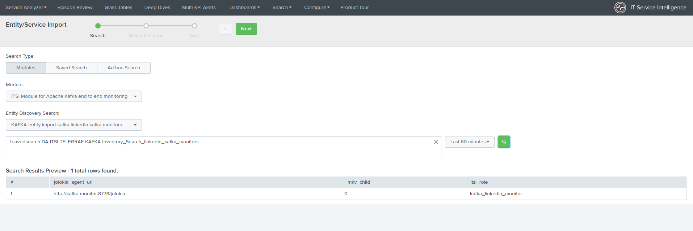

Entities discovery
==================

**The ITSI entities discovery is a fully automated process that will discover and properly configure your entities in ITSI depending on the data availability in Splunk.**

**All report rely on extremely fast and optimized queries with mcatalog, which has a negligible processing cost for the Splunk infrastructure.**

Entities automatic import
#########################

**In a nutshell, the following reports are automatically scheduled:**

+-------------------------------+----------------------------------------------------------------------+
| Purpose                       | Report                                                               |
+===============================+======================================================================+
| Zookeeper servers detection   | DA-ITSI-TELEGRAF-KAFKA-Inventory_Search_zookeeper                    |
+-------------------------------+----------------------------------------------------------------------+
| Kafka brokers detection       | DA-ITSI-TELEGRAF-KAFKA-Inventory_Search_kafka_brokers                |
+-------------------------------+----------------------------------------------------------------------+
| Kafka topics detection        | DA-ITSI-TELEGRAF-KAFKA-Inventory_Search_kafka_topics                 |
+-------------------------------+----------------------------------------------------------------------+
| Kafka connect detection       | DA-ITSI-TELEGRAF-KAFKA-Inventory_Search_kafka_connect                |
+-------------------------------+----------------------------------------------------------------------+
| Kafka connect tasks detection | DA-ITSI-TELEGRAF-KAFKA-Inventory_Search_kafka_connect_tasks          |
+-------------------------------+----------------------------------------------------------------------+
| Kafka monitors detection      | DA-ITSI-TELEGRAF-KAFKA-Inventory_Search_linkedin_kafka_monitors      |
+-------------------------------+----------------------------------------------------------------------+
| Kafka Consumers detection     | DA-ITSI-TELEGRAF-KAFKA-Inventory_Search_kafka_burrow_group_consumers |
+-------------------------------+----------------------------------------------------------------------+
| Confluent schema-registry     | DA-ITSI-TELEGRAF-KAFKA-Inventory_Search_kafka_schema-registry        |
+-------------------------------+----------------------------------------------------------------------+
| Confluent ksql-server         | DA-ITSI-TELEGRAF-KAFKA-Inventory_Search_kafka-ksql-server            |
+-------------------------------+----------------------------------------------------------------------+
| Confluent kafka-rest          | DA-ITSI-TELEGRAF-KAFKA-Inventory_Search_kafka-kafka-rest             |
+-------------------------------+----------------------------------------------------------------------+

**When entities are discovered, entities will be added automatically using the itsi_role information field, in addition with several other info fields depending on the components.**

Manual entities import
######################

**It is possible to manually import the entities in ITSI, and use the searches above:**

*Configure / Entities / New Entity / Import from Search*

Then select the module name, and depending on your needs select the relevant search.

Zookeeper server detection
--------------------------

Kafka brokers detection
-----------------------

Kafka topics detection
----------------------

Kafka connect detection
-----------------------

Kafka connect tasks detection
-----------------------------

Kafka consumers detection (Burrow)
----------------------------------

Confluent schema-registry nodes detection
-----------------------------------------

Confluent ksql-server nodes detection
-------------------------------------

Confluent kafka-rest nodes detection
------------------------------------

LinkedIn Kafka monitor nodes detection
--------------------------------------

