Telegraf Health views
=====================

**Through builtin ITSI deepdive links, you can automatically and easily access to the rich Telegraf OS views.**

View for Linux OS
#################

The Health view for Linux OS automatically appears as "Telegraf OS (Linux)" deepdive drilldown link when entities are discovered:

.. image:: img/main_linux.png
   :alt: main_linux.png
   :align: center

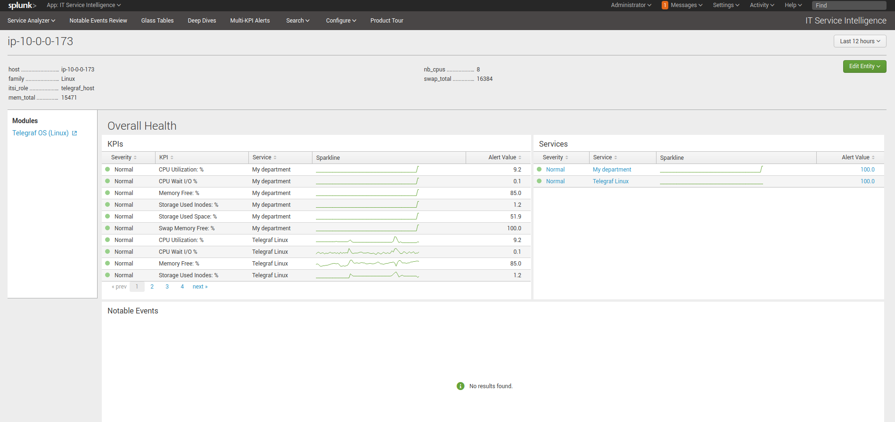

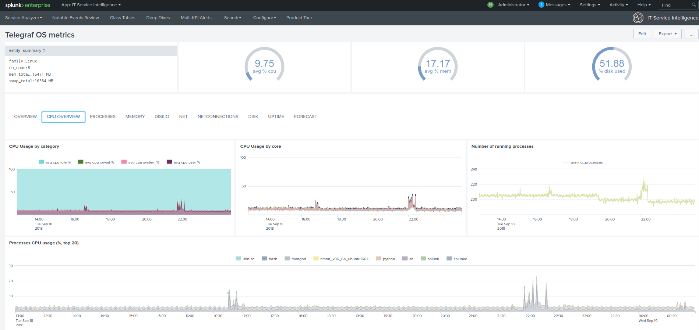

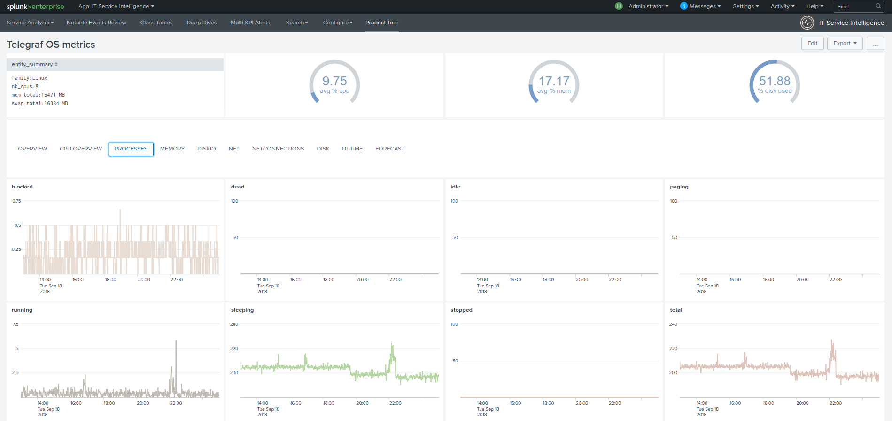

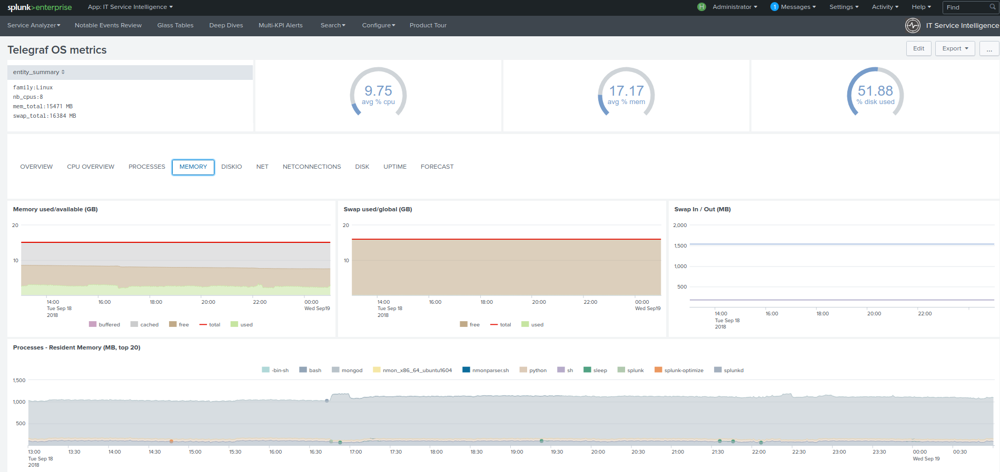

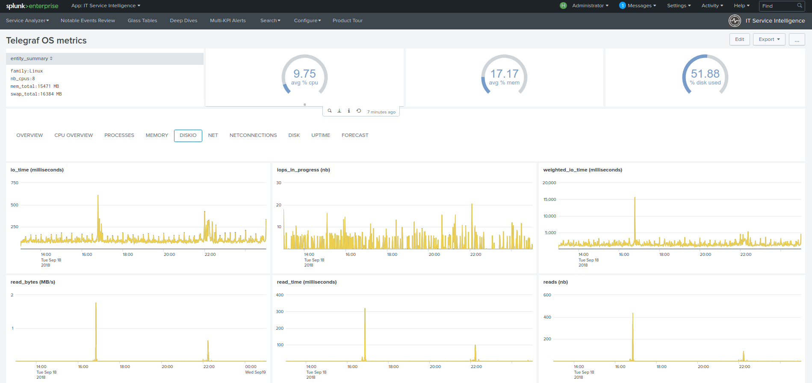

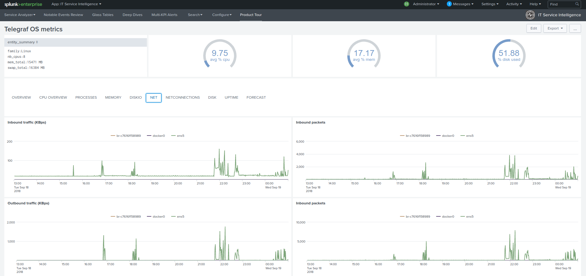

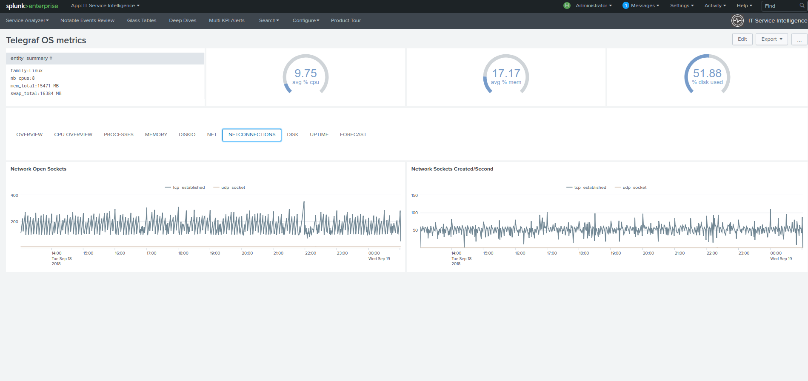

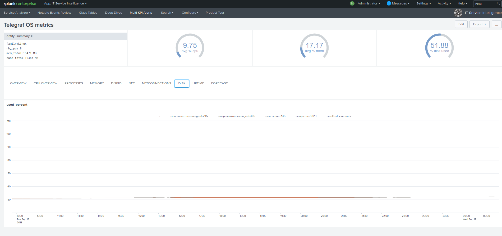

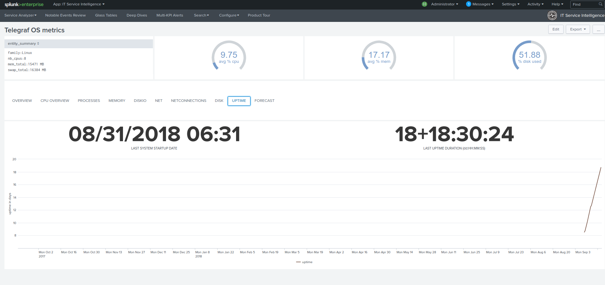

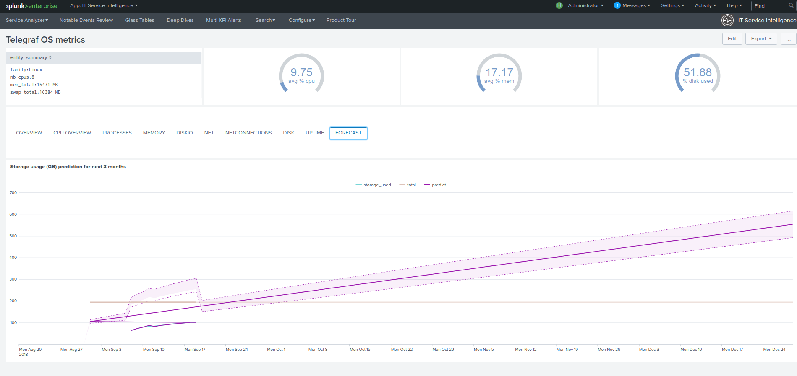

View for Windows OS
###################

The Health view for Linux OS automatically appears as "Telegraf OS (Windows)" deepdive drilldown link when entities are discovered:

.. image:: img/main_windows.png
   :alt: main_windows.png
   :align: center

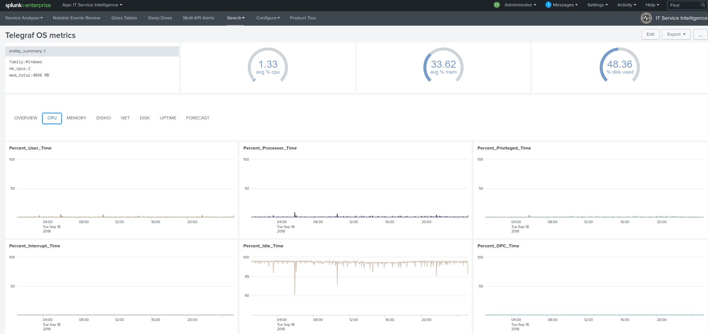

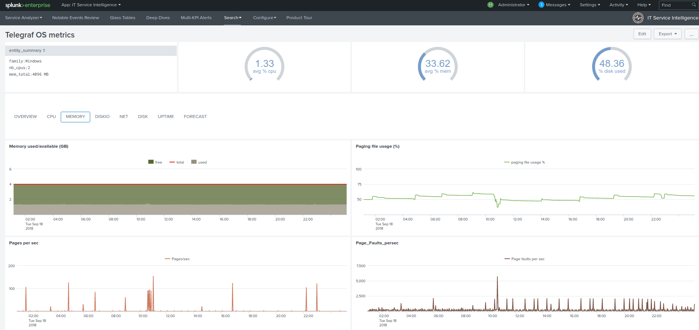

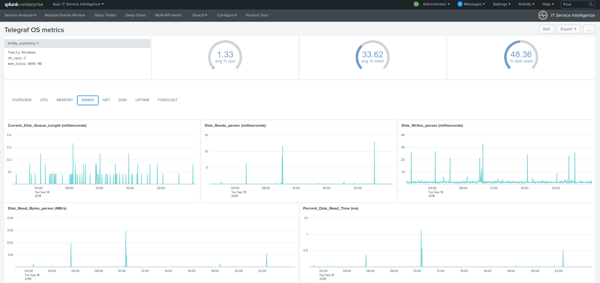

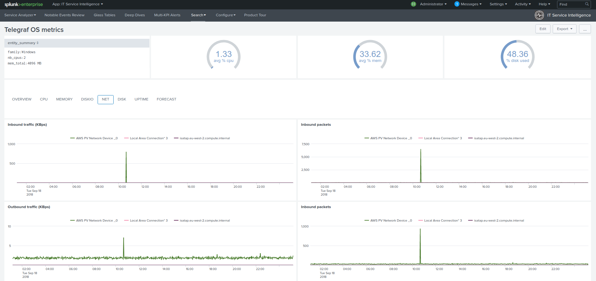

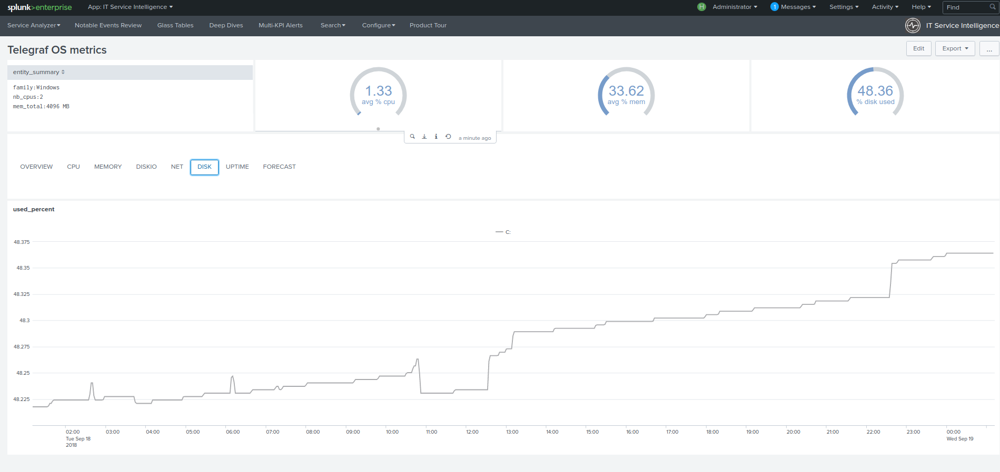

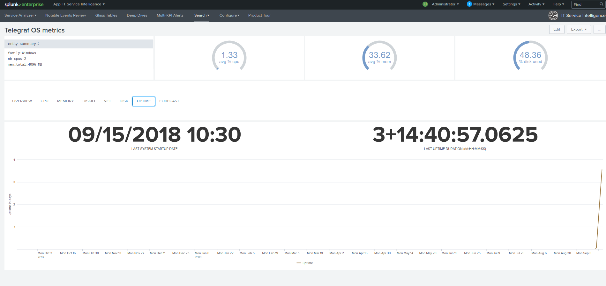

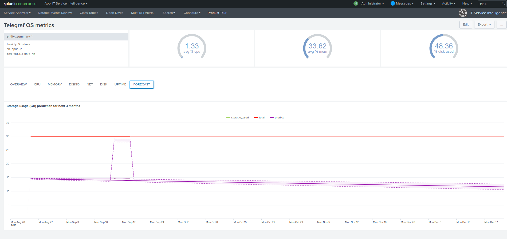

View for Windows Active Directory Domain Controller
###################################################

The Health view automatically appears as "Telegraf Win AD-DC" deepdive drilldown link when entities are discovered:

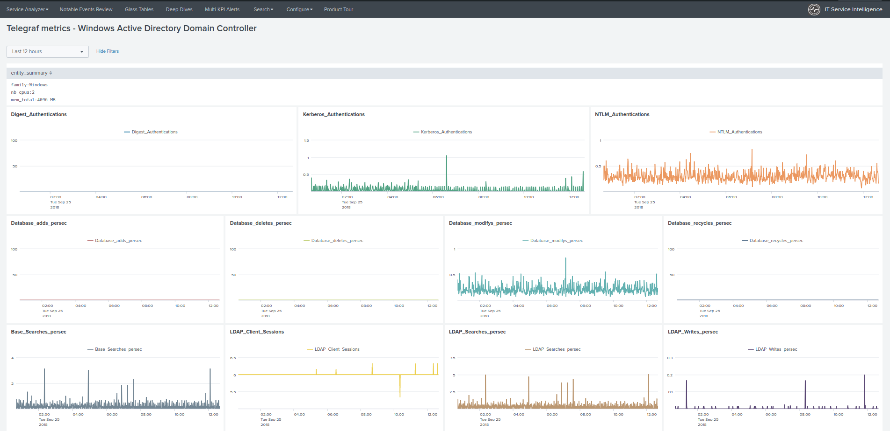

View for Windows DNS
####################

The Health view automatically appears as "Telegraf Win AD-DC" deepdive drilldown link when entities are discovered:

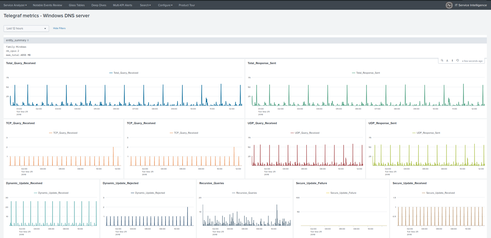

View for Windows DFS
####################

The Health view automatically appear as "Telegraf Win DFS-NS" and "Telegraf Win DFS-REP" deepdive drilldown links when entities are discovered:

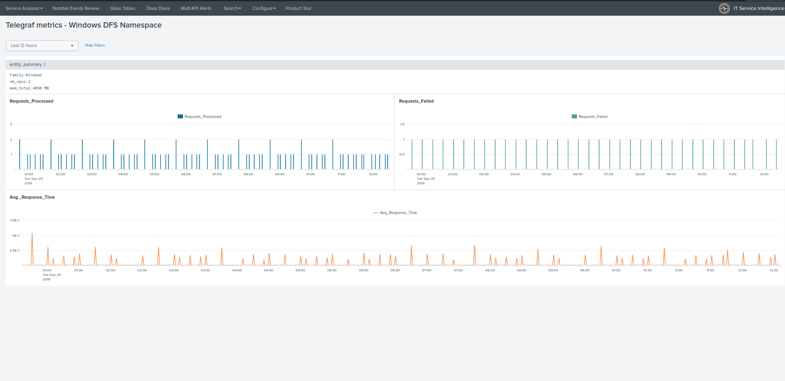

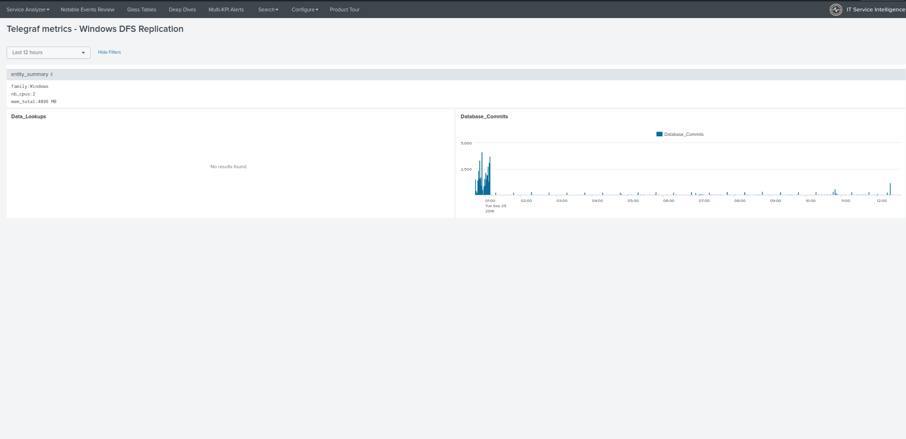

View for Microsoft IIS/ASP.NET
##############################

The Health view automatically appears as "Telegraf IIS / ASP.NET" deepdive drilldown links when entities are discovered:

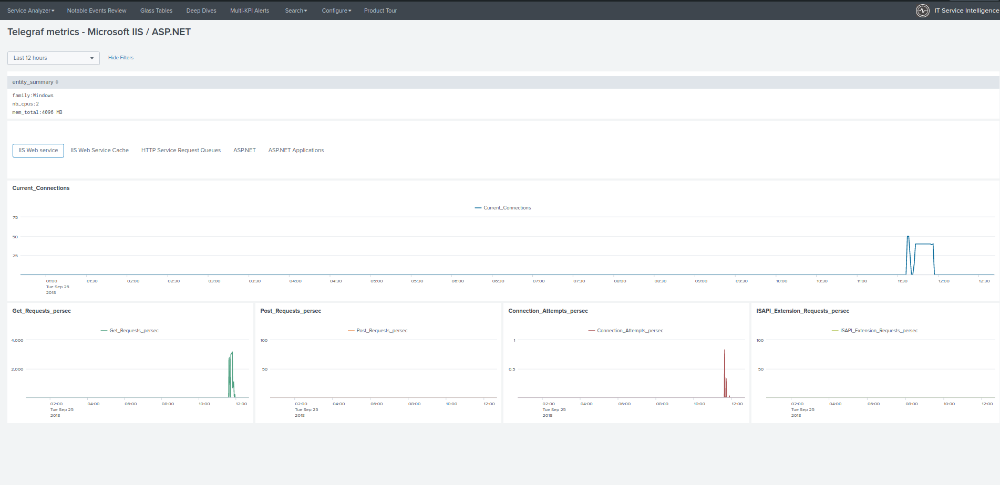
