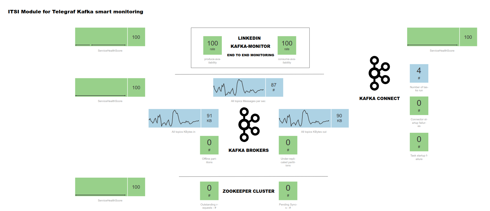

.. DA-ITSI-TELEGRAF-KAFJA documentation master file, created by
   sphinx-quickstart on Tue Sep 18 23:25:46 2018.
   You can adapt this file completely to your liking, but it should at least
   contain the root `toctree` directive.

Welcome to the ITSI module for Telegraf Apache Kafka smart monitoring documentation
===================================================================================

The ITSI module for Telegraf Kafka monitoring provides smart insight monitoring for Apache Kafka monitoring, on top of Splunk and ITSI.

The best components are leveraged together to bring the power of a solution with no equivalent on the market.

.. image:: img/main1.png
   :alt: main1.png
   :align: center

The ITSI provides builtin and native monitoring for Apache Kafka components, as well as the Confluent stack components:

* Zookeeper
* Apache Kafka Brokers
* Apache Kafka Connect
* Confluent schema-registry
* Confluent ksql-server
* Confluent kafka-rest
* Kafka SLA and end to end monitoring with the Linkedin Kafka monitor

Overview:
=========

.. toctree::
   :maxdepth: 2

   about
   compatibility
   knownissues
   support
   download

Deployment and configuration:
=============================

.. toctree::
   :maxdepth: 2

   deployment
   kafka_monitoring
   docker_testing
   entities
   service_creation
   health_view

Troubleshoot:
=============

.. toctree::
   :maxdepth: 1

   troubleshoot

Versioniong and build history:
==============================

.. toctree::
   :maxdepth: 1

   releasenotes
