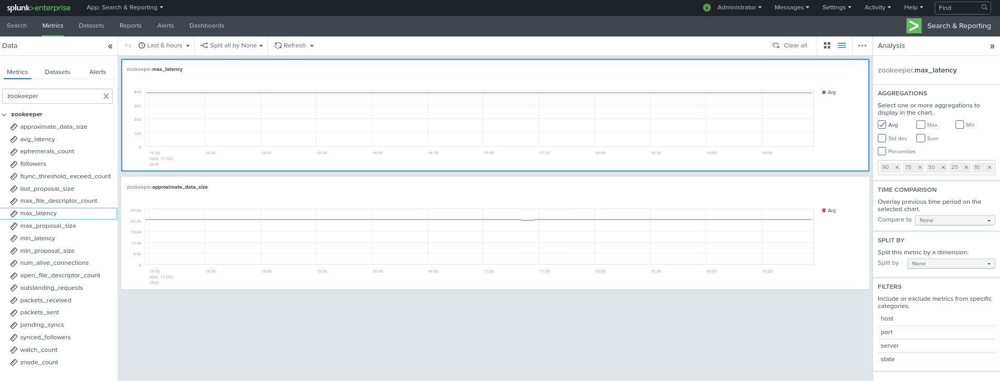
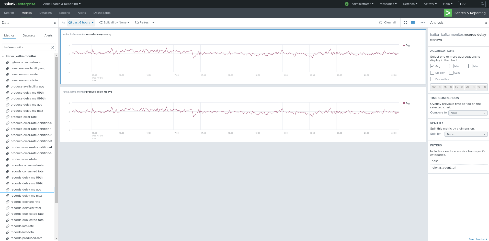
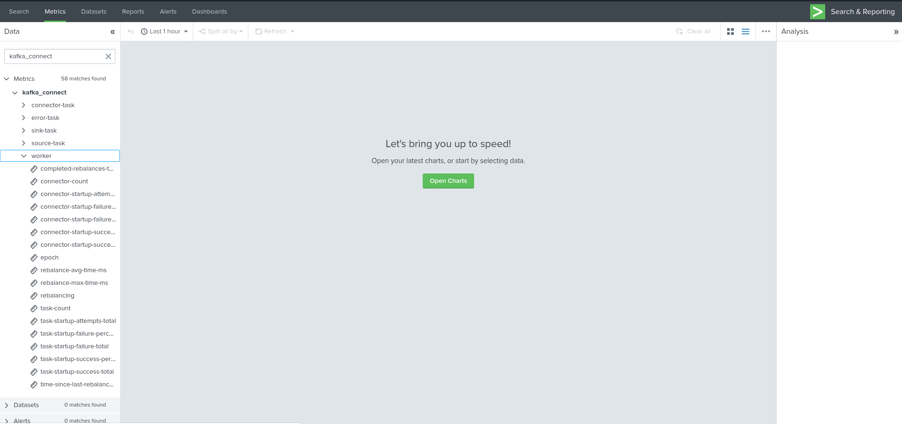

Implementation
##############

Telegraf installation and configuration
=======================================

Telegraf installation, configuration and start
----------------------------------------------

**If you are running Telegraf as a regular process in machine, the installation of Telegraf is really straightforward, consult:**

- https://github.com/influxdata/telegraf

**Telegraf is extremely container friendly, and in the context of Kafka monitoring this is even by far the best approach:**

- https://hub.docker.com/r/_/telegraf/

**YAML configuration are provided for docker-compose and Kubernetes!**

Telegraf output configuration
=============================

Whether you will be running Telegraf in various containers, or installed as a regular software within the different servers composing your Kafka
infrastructure, a minimal configuration is required to teach Telegraf how to forward the metrics to your Splunk deployment.

**Telegraf is able to send to data to Splunk in different ways:**

* Splunk HTTP Events Collector (HEC) - Since Telegraf v1.8
* Splunk TCP inputs in Graphite format with tags support and the TA for Telegraf
* Apache Kafka topic in Graphite format with tags support and the TA for Telegraf and Splunk connect for Kafka

**Who watches for the watcher?**

As you are running a Kafka deployment, it would seem very logical to produce metrics in a Kafka topic.
However, it presents a specific concern for Kafka itself.

If you use this same system for monitoring Kafka itself, it is very likely that you will never know when Kafka is broken because the data flow for your monitoring system will be broken as well.

The recommendation is to rely either on Splunk HEC or TCP inputs to forward Telegraf metrics data for the Kafka monitoring.

**A minimal configuration for telegraf.conf, running in container or as a regular process in machine and forwarding to HEC:**::

    [agent]
      interval = "10s"
      flush_interval = "10s"
      hostname = "$HOSTNAME"

    # outputs
    [[outputs.http]]
       url = "https://splunk:8088/services/collector"
       insecure_skip_verify = true
       data_format = "splunkmetric"
        ## Provides time, index, source overrides for the HEC
       splunkmetric_hec_routing = true
        ## Additional HTTP headers
        [outputs.http.headers]
       # Should be set manually to "application/json" for json data_format
          Content-Type = "application/json"
          Authorization = "Splunk 205d43f1-2a31-4e60-a8b3-327eda49944a"
          X-Splunk-Request-Channel = "205d43f1-2a31-4e60-a8b3-327eda49944a"

**If for some reasons, you have to use either of the 2 other solutions, please consult:**

* https://da-itsi-telegraf-os.readthedocs.io/en/latest/telegraf.html

Zookeeper monitoring
====================

The Zookeeper monitoring is very simple and achieved by Telegraf and the Zookeeper input plugin.

**The following configuration stands in telegraf.conf and configures the input plugin to monitor multiple Zookeeper servers from one source:**::

    # zookeeper metrics
    [[inputs.zookeeper]]
      servers = ["zookeeper-1:12181","zookeeper-2:22181","zookeeper-3:32181"]

**Alternatively if each server runs an instance of Zookeeper and you deploy Telegraf, you can simply collect from the localhost:**::

    # zookeeper metrics
    [[inputs.zookeeper]]
      servers = ["localhost:12181"]

**Vizualizations of metrics within the Splunk metrics workspace application:**

**Using mcatalog search command to verify data availability:**::

    | mcatalog values(metric_name) values(_dims) where index=* metric_name=zookeeper.*

**Running the collector as a docker container:**

It is very easy, and makes lots of sense, to run the collector in a docker container, consult my repository of YAML example:

- <URL AWAITING>

Kafka brokers monitoring with Jolokia
=====================================

Deploying Jolokia
-----------------

**Jolokia is a very powerful JMX agent that can be attached to the existing JVM.**

In the context of Kafka, once the agent jar file has been uploaded to the broker, the only thing required is adding the following settings in the JAVA startup command line of Kafka (KAFKA_OPTS):::

    -javaagent:/opt/jolokia/jolokia-jvm-1.6.0-agent.jar=port=8778,host=0.0.0.0

Which automatically starts Jolokia and allows it to listen to any incoming connection, more settings are available off course.

**In a docker environment, you will rely on environment variables, example with an extract from a docker-compose configuration:**::

    environment:
      KAFKA_BROKER_ID: 1
      KAFKA_ZOOKEEPER_CONNECT: zookeeper-1:12181,zookeeper-2:12181,zookeeper-3:12181
      KAFKA_ADVERTISED_LISTENERS: PLAINTEXT://kafka-1:19092
      KAFKA_OPTS: "-javaagent:/opt/jolokia/jolokia-jvm-1.6.0-agent.jar=port=8778,host=0.0.0.0"

Collecting with Telegraf
------------------------

In the same way than with Zookeeper, your Telegraf deployment relies your preferences, and the way you run Kafka. (containers opposed to dedicated machines)

**The following configuration stands in telegraf.conf and configures the input plugin to monitor multiple Kafka brokers from one Teleraf:**::

    # Kafka JVM monitoring
    [[inputs.jolokia2_agent]]
      name_prefix = "kafka_"
      urls = ["http://kafka-1:18778/jolokia","http://kafka-2:28778/jolokia","http://kafka-3:38778/jolokia"]

**The following configuration stands in telegraf.conf and configures the input plugin to monitor the Kafka broker running on the localhost where Telegraf is running:**::

    # Kafka JVM monitoring
    [[inputs.jolokia2_agent]]
      name_prefix = "kafka_"
      urls = ["http://localhost:8778/jolokia"]

Kafka broker JMX beans model
----------------------------

**After this initial configuration comes the configuration of the JMX beans to be collected, the ITSI module relies on the following model:**::

    [[inputs.jolokia2_agent.metric]]
      name         = "controller"
      mbean        = "kafka.controller:name=*,type=*"
      field_prefix = "$1."

    [[inputs.jolokia2_agent.metric]]
      name         = "replica_manager"
      mbean        = "kafka.server:name=*,type=ReplicaManager"
      field_prefix = "$1."

    [[inputs.jolokia2_agent.metric]]
      name         = "purgatory"
      mbean        = "kafka.server:delayedOperation=*,name=*,type=DelayedOperationPurgatory"
      field_prefix = "$1."
      field_name   = "$2"

    [[inputs.jolokia2_agent.metric]]
      name     = "client"
      mbean    = "kafka.server:client-id=*,type=*"
      tag_keys = ["client-id", "type"]

    [[inputs.jolokia2_agent.metric]]
      name         = "network"
      mbean        = "kafka.network:name=*,request=*,type=RequestMetrics"
      field_prefix = "$1."
      tag_keys     = ["request"]

    [[inputs.jolokia2_agent.metric]]
      name         = "network"
      mbean        = "kafka.network:name=ResponseQueueSize,type=RequestChannel"
      field_prefix = "ResponseQueueSize"
      tag_keys     = ["name"]

    [[inputs.jolokia2_agent.metric]]
      name         = "network"
      mbean        = "kafka.network:name=NetworkProcessorAvgIdlePercent,type=SocketServer"
      field_prefix = "NetworkProcessorAvgIdlePercent"
      tag_keys     = ["name"]

    [[inputs.jolokia2_agent.metric]]
      name         = "topics"
      mbean        = "kafka.server:name=*,type=BrokerTopicMetrics"
      field_prefix = "$1."

    [[inputs.jolokia2_agent.metric]]
      name         = "topic"
      mbean        = "kafka.server:name=*,topic=*,type=BrokerTopicMetrics"
      field_prefix = "$1."
      tag_keys     = ["topic"]

    [[inputs.jolokia2_agent.metric]]
      name       = "partition"
      mbean      = "kafka.log:name=*,partition=*,topic=*,type=Log"
      field_name = "$1"
      tag_keys   = ["topic", "partition"]

    [[inputs.jolokia2_agent.metric]]
      name       = "log"
      mbean      = "kafka.log:name=LogFlushRateAndTimeMs,type=LogFlushStats"
      field_name = "LogFlushRateAndTimeMs"
      tag_keys   = ["name"]

    [[inputs.jolokia2_agent.metric]]
      name       = "partition"
      mbean      = "kafka.cluster:name=UnderReplicated,partition=*,topic=*,type=Partition"
      field_name = "UnderReplicatedPartitions"
      tag_keys   = ["topic", "partition"]

    [[inputs.jolokia2_agent.metric]]
      name     = "request_handlers"
      mbean    = "kafka.server:name=RequestHandlerAvgIdlePercent,type=KafkaRequestHandlerPool"
      tag_keys = ["name"]

    # JVM garbage collector monitoring
    [[inputs.jolokia2_agent.metric]]
      name     = "jvm_garbage_collector"
      mbean    = "java.lang:name=*,type=GarbageCollector"
      paths    = ["CollectionTime", "CollectionCount", "LastGcInfo"]
      tag_keys = ["name"]

Full telegraf.conf example
--------------------------

*The following telegraf.conf collects a cluster of 3 Kafka brokers:*::

    [agent]
      interval = "10s"
      flush_interval = "10s"
      hostname = "$HOSTNAME"

    # outputs
    [[outputs.http]]
       url = "https://splunk:8088/services/collector"
       insecure_skip_verify = true
       data_format = "splunkmetric"
        ## Provides time, index, source overrides for the HEC
       splunkmetric_hec_routing = true
        ## Additional HTTP headers
        [outputs.http.headers]
       # Should be set manually to "application/json" for json data_format
          Content-Type = "application/json"
          Authorization = "Splunk 205d43f1-2a31-4e60-a8b3-327eda49944a"
          X-Splunk-Request-Channel = "205d43f1-2a31-4e60-a8b3-327eda49944a"

    # Kafka JVM monitoring

    [[inputs.jolokia2_agent]]
      name_prefix = "kafka_"
      urls = ["http://kafka-1:18778/jolokia","http://kafka-2:28778/jolokia","http://kafka-3:38778/jolokia"]

    [[inputs.jolokia2_agent.metric]]
      name         = "controller"
      mbean        = "kafka.controller:name=*,type=*"
      field_prefix = "$1."

    [[inputs.jolokia2_agent.metric]]
      name         = "replica_manager"
      mbean        = "kafka.server:name=*,type=ReplicaManager"
      field_prefix = "$1."

    [[inputs.jolokia2_agent.metric]]
      name         = "purgatory"
      mbean        = "kafka.server:delayedOperation=*,name=*,type=DelayedOperationPurgatory"
      field_prefix = "$1."
      field_name   = "$2"

    [[inputs.jolokia2_agent.metric]]
      name     = "client"
      mbean    = "kafka.server:client-id=*,type=*"
      tag_keys = ["client-id", "type"]

    [[inputs.jolokia2_agent.metric]]
      name         = "network"
      mbean        = "kafka.network:name=*,request=*,type=RequestMetrics"
      field_prefix = "$1."
      tag_keys     = ["request"]

    [[inputs.jolokia2_agent.metric]]
      name         = "network"
      mbean        = "kafka.network:name=ResponseQueueSize,type=RequestChannel"
      field_prefix = "ResponseQueueSize"
      tag_keys     = ["name"]

    [[inputs.jolokia2_agent.metric]]
      name         = "network"
      mbean        = "kafka.network:name=NetworkProcessorAvgIdlePercent,type=SocketServer"
      field_prefix = "NetworkProcessorAvgIdlePercent"
      tag_keys     = ["name"]

    [[inputs.jolokia2_agent.metric]]
      name         = "topics"
      mbean        = "kafka.server:name=*,type=BrokerTopicMetrics"
      field_prefix = "$1."

    [[inputs.jolokia2_agent.metric]]
      name         = "topic"
      mbean        = "kafka.server:name=*,topic=*,type=BrokerTopicMetrics"
      field_prefix = "$1."
      tag_keys     = ["topic"]

    [[inputs.jolokia2_agent.metric]]
      name       = "partition"
      mbean      = "kafka.log:name=*,partition=*,topic=*,type=Log"
      field_name = "$1"
      tag_keys   = ["topic", "partition"]

    [[inputs.jolokia2_agent.metric]]
      name       = "log"
      mbean      = "kafka.log:name=LogFlushRateAndTimeMs,type=LogFlushStats"
      field_name = "LogFlushRateAndTimeMs"
      tag_keys   = ["name"]

    [[inputs.jolokia2_agent.metric]]
      name       = "partition"
      mbean      = "kafka.cluster:name=UnderReplicated,partition=*,topic=*,type=Partition"
      field_name = "UnderReplicatedPartitions"
      tag_keys   = ["topic", "partition"]

    [[inputs.jolokia2_agent.metric]]
      name     = "request_handlers"
      mbean    = "kafka.server:name=RequestHandlerAvgIdlePercent,type=KafkaRequestHandlerPool"
      tag_keys = ["name"]

    # JVM garbage collector monitoring
    [[inputs.jolokia2_agent.metric]]
      name     = "jvm_garbage_collector"
      mbean    = "java.lang:name=*,type=GarbageCollector"
      paths    = ["CollectionTime", "CollectionCount", "LastGcInfo"]
      tag_keys = ["name"]

**Vizualizations of metrics within the Splunk metrics workspace application:**

**Using mcatalog search command to verify data availability:**::

    | mcatalog values(metric_name) values(_dims) where index=* metric_name=kafka_*.*

Kafka connect monitoring
========================

Deploying Jolokia
-----------------

**Jolokia is a very powerful JMX agent that can be attached to the existing JVM.**

In the context of Kafka, once the agent jar file has been uploaded to the broker, the only thing required is adding the following settings in the JAVA startup command line of Kafka (KAFKA_OPTS):::

    -javaagent:/opt/jolokia/jolokia-jvm-1.6.0-agent.jar=port=8778,host=0.0.0.0

Which automatically starts Jolokia and allows it to listen to any incoming connection, more settings are available off course.

**In a docker environment, you will rely on environment variables, example with an extract from a docker-compose configuration:**::

    environment:
      KAFKA_OPTS: "-javaagent:/opt/jolokia/jolokia-jvm-1.6.0-agent.jar=port=18779,host=0.0.0.0"
    command: "/usr/bin/connect-distributed /etc/kafka-connect/config/connect-distributed.properties-kafka-connect-1"

Collecting with Telegraf
------------------------

In the same way than with Zookeeper, your Telegraf deployment relies your preferences, and the way you run Kafka. (containers opposed to dedicated machines)

**The following configuration stands in telegraf.conf and configures the input plugin to monitor multiple Kafka brokers from one Teleraf:**::

   # Kafka-connect JVM monitoring
   [[inputs.jolokia2_agent]]
     name_prefix = "kafka_connect."
     urls = ["http://kafka-connect-1:18779/jolokia","http://kafka-connect-2:28779/jolokia","http://kafka-connect-3:38779/jolokia"]

**The following configuration stands in telegraf.conf and configures the input plugin to monitor the Kafka broker running on the localhost where Telegraf is running:**::

   # Kafka-connect JVM monitoring
    [[inputs.jolokia2_agent]]
      name_prefix = "kafka_"
      urls = ["http://localhost:8778/jolokia"]

Full telegraf.conf example
--------------------------

*bellow a full telegraf.conf example:*::

   [agent]
     interval = "10s"
     flush_interval = "10s"
     hostname = "$HOSTNAME"

   # outputs
   [[outputs.http]]
      url = "https://splunk:8088/services/collector"
      insecure_skip_verify = true
      data_format = "splunkmetric"
       ## Provides time, index, source overrides for the HEC
      splunkmetric_hec_routing = true
       ## Additional HTTP headers
       [outputs.http.headers]
      # Should be set manually to "application/json" for json data_format
         Content-Type = "application/json"
         Authorization = "Splunk 205d43f1-2a31-4e60-a8b3-327eda49944a"
         X-Splunk-Request-Channel = "205d43f1-2a31-4e60-a8b3-327eda49944a"

   # Kafka-connect JVM monitoring

   [[inputs.jolokia2_agent]]
     name_prefix = "kafka_connect."
     urls = ["http://kafka-connect-1:18779/jolokia","http://kafka-connect-2:28779/jolokia","http://kafka-connect-3:38779/jolokia"]

   [[inputs.jolokia2_agent.metric]]
     name         = "worker"
     mbean        = "kafka.connect:type=connect-worker-metrics"

   [[inputs.jolokia2_agent.metric]]
     name         = "worker"
     mbean        = "kafka.connect:type=connect-worker-rebalance-metrics"

   [[inputs.jolokia2_agent.metric]]
     name         = "connector-task"
     mbean        = "kafka.connect:type=connector-task-metrics,connector=*,task=*"
     tag_keys = ["connector", "task"]

   [[inputs.jolokia2_agent.metric]]
     name         = "sink-task"
     mbean        = "kafka.connect:type=sink-task-metrics,connector=*,task=*"
     tag_keys = ["connector", "task"]

   [[inputs.jolokia2_agent.metric]]
     name         = "source-task"
     mbean        = "kafka.connect:type=source-task-metrics,connector=*,task=*"
     tag_keys = ["connector", "task"]

   [[inputs.jolokia2_agent.metric]]
     name         = "error-task"
     mbean        = "kafka.connect:type=task-error-metrics,connector=*,task=*"
     tag_keys = ["connector", "task"]

**Vizualizations of metrics within the Splunk metrics workspace application:**

**Using mcatalog search command to verify data availability:**::

    | mcatalog values(metric_name) values(_dims) where index=* metric_name=kafka_connect.*

Kafka LinkedIn monitor - end to end monitoring
==============================================

Installing and starting the Kafka monitor
-----------------------------------------

**LinkedIn provides an extremely powerful open source end to end monitoring solution for Kafka, please consult:**

* https://github.com/linkedin/kafka-monitor

As a builtin configuration, the kafka-monitor implements a jolokia agent, so collecting the metrics with Telegraf cannot be more easy !

**It is very straightforward to run the kafka-monitor in a docker container, first you need to create your own image:**

* https://github.com/linkedin/kafka-monitor/tree/master/docker

**Once your Kafka monitor is running, you need a Telegraf instance that will be collecting the JMX beans, example:**::

    [agent]
      interval = "10s"
      flush_interval = "10s"
      hostname = "$HOSTNAME"

    # outputs
    [[outputs.http]]
       url = "https://splunk:8088/services/collector"
       insecure_skip_verify = true
       data_format = "splunkmetric"
        ## Provides time, index, source overrides for the HEC
       splunkmetric_hec_routing = true
        ## Additional HTTP headers
        [outputs.http.headers]
       # Should be set manually to "application/json" for json data_format
          Content-Type = "application/json"
          Authorization = "Splunk 205d43f1-2a31-4e60-a8b3-327eda49944a"
          X-Splunk-Request-Channel = "205d43f1-2a31-4e60-a8b3-327eda49944a"

    # Kafka JVM monitoring

    [[inputs.jolokia2_agent]]
      name_prefix = "kafka_"
      urls = ["http://kafka-monitor:8778/jolokia"]

    [[inputs.jolokia2_agent.metric]]
      name         = "kafka-monitor"
      mbean        = "kmf.services:name=*,type=*"

**Vizualizations of metrics within the Splunk metrics workspace application:**

**Using mcatalog search command to verify data availability:**::

    | mcatalog values(metric_name) values(_dims) where index=* metric_name=kafka_kafka-monitor.*

