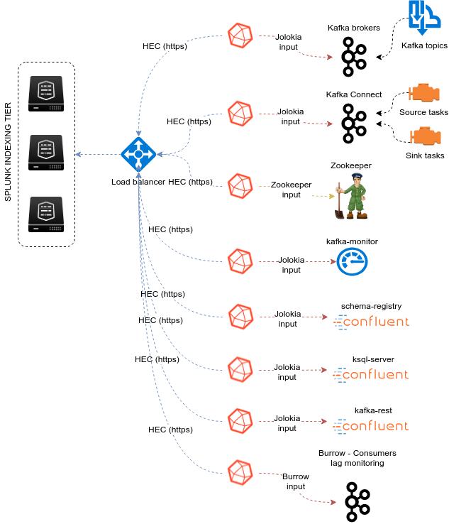

Implementation
##############

*Data collection diagram overview:*

Splunk configuration
====================

Index definition
----------------

**The ITSI module relies by default on the creation of a metrics index called "telegraf_kafka":**

*indexes.conf example with no Splunk volume:*

::

   [telegraf_kafka]
   coldPath = $SPLUNK_DB/telegraf_kafka/colddb
   datatype = metric
   homePath = $SPLUNK_DB/telegraf_kafka/db
   thawedPath = $SPLUNK_DB/telegraf_kafka/thaweddb

*indexes.conf example with Splunk volumes:*

::

   [telegraf_kafka]
   coldPath = volume:cold/telegraf_kafka/colddb
   datatype = metric
   homePath = volume:primary/telegraf_kafka/db
   thawedPath = $SPLUNK_DB/telegraf_kafka/thaweddb

In a Splunk distributed configuration (cluster of indexers), this configuration stands on the cluster master node.

All Splunk searches included in the added refer to the utilisation of a macro called **"telegraf_kafka_index"** including in:

* DA-ITSI-TELEGRAF-KAFKA/default/macros.conf

If you wish to use a different index model, this macro shall be customized to override the default model, and no other modification will be required.

HEC input ingestion and definition
----------------------------------

**The default recommended way of ingesting the Kafka metrics is using the HTTP Events Collector method which requires the creation of an HEC input.**

*inputs.conf example:*

::

   [http://telegraf_kafka_monitoring]
   disabled = 0
   index = telegraf_kafka
   token = 205d43f1-2a31-4e60-a8b3-327eda49944a

If you create the HEC input via Splunk Web interface, it is not required to select an explicit value for source and sourcetype.

The HEC input will be ideally relying on a load balancer to provides resiliency and load balancing across your HEC input nodes.

Other ingesting methods
-----------------------

**There are other methods possible to ingest the Kafka metrics in Splunk:**

* TCP input (graphite format with tags support)
* KAFKA ingestion (Kafka destination from Telegraf in graphite format with tags support, and Splunk connect for Kafka)
* File monitoring with standard Splunk input monitors (file output plugin from Telegraf)

Notes: In the very specific context of monitoring Kafka, it is not a good design to use Kafka as the ingestion method since you will most likely never be able to know when an issue happens on Kafka.

**These methods require the deployment of an additional Technology addon:** https://splunkbase.splunk.com/app/4193

**These methods are heavily described here:** https://da-itsi-telegraf-os.readthedocs.io/en/latest/telegraf.html

Telegraf installation and configuration
=======================================

Telegraf installation, configuration and start
----------------------------------------------

**If you are running Telegraf as a regular process in machine, the installation of Telegraf is really straightforward, consult:**

- https://github.com/influxdata/telegraf

**Telegraf is extremely container friendly, a container approach is very convenient as you can easily run multiple Telegraf containers to monitor each of the Kafka infrastructure components:**

- https://hub.docker.com/r/_/telegraf/

Telegraf output configuration
=============================

Whether you will be running Telegraf in various containers, or installed as a regular software within the different servers composing your Kafka
infrastructure, a minimal configuration is required to teach Telegraf how to forward the metrics to your Splunk deployment.

**Telegraf is able to send to data to Splunk in different ways:**

* Splunk HTTP Events Collector (HEC) - Since Telegraf v1.8
* Splunk TCP inputs in Graphite format with tags support and the TA for Telegraf
* Apache Kafka topic in Graphite format with tags support and the TA for Telegraf and Splunk connect for Kafka

**Who watches for the watcher?**

As you are running a Kafka deployment, it would seem very logical to produce metrics in a Kafka topic.
However, it presents a specific concern for Kafka itself.

If you use this same system for monitoring Kafka itself, it is very likely that you will never know when Kafka is broken because the data flow for your monitoring system will be broken as well.

The recommendation is to rely either on Splunk HEC or TCP inputs to forward Telegraf metrics data for the Kafka monitoring.

**A minimal configuration for telegraf.conf, running in container or as a regular process in machine and forwarding to HEC:**

::

    [agent]
      interval = "10s"
      flush_interval = "10s"
      hostname = "$HOSTNAME"

    # outputs
    [[outputs.http]]
       url = "https://splunk:8088/services/collector"
       insecure_skip_verify = true
       data_format = "splunkmetric"
        ## Provides time, index, source overrides for the HEC
       splunkmetric_hec_routing = true
        ## Additional HTTP headers
        [outputs.http.headers]
       # Should be set manually to "application/json" for json data_format
          Content-Type = "application/json"
          Authorization = "Splunk 205d43f1-2a31-4e60-a8b3-327eda49944a"
          X-Splunk-Request-Channel = "205d43f1-2a31-4e60-a8b3-327eda49944a"

**If for some reasons, you have to use either of the 2 other solutions, please consult:**

* https://da-itsi-telegraf-os.readthedocs.io/en/latest/telegraf.html

Jolokia JVM monitoring
======================

**Kafka components are being monitored through the very powerful Jolokia agent:**

- https://jolokia.org

**Basically, Jolokia JVM agent can be started in 2 modes, either as using the -javaagent argument during the start of the JVM, or on the fly by attaching Jolokia to the JVM running PID:**

- https://jolokia.org/reference/html/agents.html#agents-jvm

Starting Jolokia with the JVM
=============================

**To start Jolokia agent using the -javaagent argument, use such option at the start of the JVM:**

::

    -javaagent:/opt/jolokia/jolokia-jvm-1.6.0-agent.jar=port=8778,host=0.0.0.0

*Note: This method is the method used in the docker example within this documentation by using the environment variables of the container.*

Starting Jolokia on the fly
===========================

**To attach Jolokia agent to an existing JVM, identify its process ID (PID), simplistic example:**

::

    ps -ef | grep 'kafka.properties' | grep -v grep | awk '{print $1}'

**Then:**

::

    java -jar /opt/jolokia/jolokia-jvm-1.6.0-agent.jar --host 0.0.0.0 --port 8778 start <PID>

*Add this operation to any custom init scripts you use to start the Kafka components.*

Zookeeper monitoring
====================

Collecting with Telegraf
------------------------

The Zookeeper monitoring is very simple and achieved by Telegraf and the Zookeeper input plugin.

**The following configuration stands in telegraf.conf and configures the input plugin to monitor multiple Zookeeper servers from one source:**

::

    # zookeeper metrics
    [[inputs.zookeeper]]
      servers = ["zookeeper-1:12181","zookeeper-2:22181","zookeeper-3:32181"]

**Alternatively if each server runs an instance of Zookeeper and you deploy Telegraf, you can simply collect from the localhost:**

::

    # zookeeper metrics
    [[inputs.zookeeper]]
      servers = ["localhost:12181"]

Full telegraf.conf example
--------------------------

*The following telegraf.conf collects a cluster of 3 Zookeeper servers:*

::

   [agent]
     interval = "10s"
     flush_interval = "10s"
     hostname = "$HOSTNAME"

   # outputs
   [[outputs.http]]
      url = "https://splunk:8088/services/collector"
      insecure_skip_verify = true
      data_format = "splunkmetric"
       ## Provides time, index, source overrides for the HEC
      splunkmetric_hec_routing = true
       ## Additional HTTP headers
       [outputs.http.headers]
      # Should be set manually to "application/json" for json data_format
         Content-Type = "application/json"
         Authorization = "Splunk 205d43f1-2a31-4e60-a8b3-327eda49944a"
         X-Splunk-Request-Channel = "205d43f1-2a31-4e60-a8b3-327eda49944a"

   # zookeeper metrics
   [[inputs.zookeeper]]
     servers = ["zookeeper-1:12181","zookeeper-2:22181","zookeeper-3:32181"]

**Vizualizations of metrics within the Splunk metrics workspace application:**

.. image:: img/zookeeper_metrics_workspace.png
   :alt: zookeeper_metrics_workspace.png
   :align: center

**Using mcatalog search command to verify data availability:**

::

    | mcatalog values(metric_name) values(_dims) where index=* metric_name=zookeeper.*

Kafka brokers monitoring with Jolokia
=====================================

Jolokia
-------

**example: Jolokia start in docker environment:**

::

    environment:
      KAFKA_BROKER_ID: 1
      KAFKA_ZOOKEEPER_CONNECT: zookeeper-1:12181,zookeeper-2:12181,zookeeper-3:12181
      KAFKA_ADVERTISED_LISTENERS: PLAINTEXT://kafka-1:19092
      KAFKA_OPTS: "-javaagent:/opt/jolokia/jolokia-jvm-1.6.0-agent.jar=port=8778,host=0.0.0.0"

Collecting with Telegraf
------------------------

Depending on how you run Kafka and your architecture preferences, you may prefer to collect all the brokers metrics from one Telegraf collector, or installed locally on the Kafka brocker machine.

**The following configuration stands in telegraf.conf and configures the input plugin to monitor multiple Kafka brokers from one Teleraf:**

::

    # Kafka JVM monitoring
    [[inputs.jolokia2_agent]]
      name_prefix = "kafka_"
      urls = ["http://kafka-1:18778/jolokia","http://kafka-2:28778/jolokia","http://kafka-3:38778/jolokia"]

**The following configuration stands in telegraf.conf and configures the input plugin to monitor the Kafka broker running on the localhost assuming Telegraf is running on the same machine:**

::

    # Kafka JVM monitoring
    [[inputs.jolokia2_agent]]
      name_prefix = "kafka_"
      urls = ["http://localhost:8778/jolokia"]

Kafka broker JMX beans model
----------------------------

**After this initial configuration comes the configuration of the JMX beans to be collected, the ITSI module relies on the following model:**

::

    [[inputs.jolokia2_agent.metric]]
      name         = "controller"
      mbean        = "kafka.controller:name=*,type=*"
      field_prefix = "$1."

    [[inputs.jolokia2_agent.metric]]
      name         = "replica_manager"
      mbean        = "kafka.server:name=*,type=ReplicaManager"
      field_prefix = "$1."

    [[inputs.jolokia2_agent.metric]]
      name         = "purgatory"
      mbean        = "kafka.server:delayedOperation=*,name=*,type=DelayedOperationPurgatory"
      field_prefix = "$1."
      field_name   = "$2"

    [[inputs.jolokia2_agent.metric]]
      name     = "client"
      mbean    = "kafka.server:client-id=*,type=*"
      tag_keys = ["client-id", "type"]

    [[inputs.jolokia2_agent.metric]]
      name         = "network"
      mbean        = "kafka.network:name=*,request=*,type=RequestMetrics"
      field_prefix = "$1."
      tag_keys     = ["request"]

    [[inputs.jolokia2_agent.metric]]
      name         = "network"
      mbean        = "kafka.network:name=ResponseQueueSize,type=RequestChannel"
      field_prefix = "ResponseQueueSize"
      tag_keys     = ["name"]

    [[inputs.jolokia2_agent.metric]]
      name         = "network"
      mbean        = "kafka.network:name=NetworkProcessorAvgIdlePercent,type=SocketServer"
      field_prefix = "NetworkProcessorAvgIdlePercent"
      tag_keys     = ["name"]

    [[inputs.jolokia2_agent.metric]]
      name         = "topics"
      mbean        = "kafka.server:name=*,type=BrokerTopicMetrics"
      field_prefix = "$1."

    [[inputs.jolokia2_agent.metric]]
      name         = "topic"
      mbean        = "kafka.server:name=*,topic=*,type=BrokerTopicMetrics"
      field_prefix = "$1."
      tag_keys     = ["topic"]

    [[inputs.jolokia2_agent.metric]]
      name       = "partition"
      mbean      = "kafka.log:name=*,partition=*,topic=*,type=Log"
      field_name = "$1"
      tag_keys   = ["topic", "partition"]

    [[inputs.jolokia2_agent.metric]]
      name       = "log"
      mbean      = "kafka.log:name=LogFlushRateAndTimeMs,type=LogFlushStats"
      field_name = "LogFlushRateAndTimeMs"
      tag_keys   = ["name"]

    [[inputs.jolokia2_agent.metric]]
      name       = "partition"
      mbean      = "kafka.cluster:name=UnderReplicated,partition=*,topic=*,type=Partition"
      field_name = "UnderReplicatedPartitions"
      tag_keys   = ["topic", "partition"]

    [[inputs.jolokia2_agent.metric]]
      name     = "request_handlers"
      mbean    = "kafka.server:name=RequestHandlerAvgIdlePercent,type=KafkaRequestHandlerPool"
      tag_keys = ["name"]

    # JVM garbage collector monitoring
    [[inputs.jolokia2_agent.metric]]
      name     = "jvm_garbage_collector"
      mbean    = "java.lang:name=*,type=GarbageCollector"
      paths    = ["CollectionTime", "CollectionCount", "LastGcInfo"]
      tag_keys = ["name"]

Full telegraf.conf example
--------------------------

*The following telegraf.conf collects a cluster of 3 Kafka brokers:*

::

    [agent]
      interval = "10s"
      flush_interval = "10s"
      hostname = "$HOSTNAME"

    # outputs
    [[outputs.http]]
       url = "https://splunk:8088/services/collector"
       insecure_skip_verify = true
       data_format = "splunkmetric"
        ## Provides time, index, source overrides for the HEC
       splunkmetric_hec_routing = true
        ## Additional HTTP headers
        [outputs.http.headers]
       # Should be set manually to "application/json" for json data_format
          Content-Type = "application/json"
          Authorization = "Splunk 205d43f1-2a31-4e60-a8b3-327eda49944a"
          X-Splunk-Request-Channel = "205d43f1-2a31-4e60-a8b3-327eda49944a"

    # Kafka JVM monitoring

    [[inputs.jolokia2_agent]]
      name_prefix = "kafka_"
      urls = ["http://kafka-1:18778/jolokia","http://kafka-2:28778/jolokia","http://kafka-3:38778/jolokia"]

    [[inputs.jolokia2_agent.metric]]
      name         = "controller"
      mbean        = "kafka.controller:name=*,type=*"
      field_prefix = "$1."

    [[inputs.jolokia2_agent.metric]]
      name         = "replica_manager"
      mbean        = "kafka.server:name=*,type=ReplicaManager"
      field_prefix = "$1."

    [[inputs.jolokia2_agent.metric]]
      name         = "purgatory"
      mbean        = "kafka.server:delayedOperation=*,name=*,type=DelayedOperationPurgatory"
      field_prefix = "$1."
      field_name   = "$2"

    [[inputs.jolokia2_agent.metric]]
      name     = "client"
      mbean    = "kafka.server:client-id=*,type=*"
      tag_keys = ["client-id", "type"]

    [[inputs.jolokia2_agent.metric]]
      name         = "network"
      mbean        = "kafka.network:name=*,request=*,type=RequestMetrics"
      field_prefix = "$1."
      tag_keys     = ["request"]

    [[inputs.jolokia2_agent.metric]]
      name         = "network"
      mbean        = "kafka.network:name=ResponseQueueSize,type=RequestChannel"
      field_prefix = "ResponseQueueSize"
      tag_keys     = ["name"]

    [[inputs.jolokia2_agent.metric]]
      name         = "network"
      mbean        = "kafka.network:name=NetworkProcessorAvgIdlePercent,type=SocketServer"
      field_prefix = "NetworkProcessorAvgIdlePercent"
      tag_keys     = ["name"]

    [[inputs.jolokia2_agent.metric]]
      name         = "topics"
      mbean        = "kafka.server:name=*,type=BrokerTopicMetrics"
      field_prefix = "$1."

    [[inputs.jolokia2_agent.metric]]
      name         = "topic"
      mbean        = "kafka.server:name=*,topic=*,type=BrokerTopicMetrics"
      field_prefix = "$1."
      tag_keys     = ["topic"]

    [[inputs.jolokia2_agent.metric]]
      name       = "partition"
      mbean      = "kafka.log:name=*,partition=*,topic=*,type=Log"
      field_name = "$1"
      tag_keys   = ["topic", "partition"]

    [[inputs.jolokia2_agent.metric]]
      name       = "log"
      mbean      = "kafka.log:name=LogFlushRateAndTimeMs,type=LogFlushStats"
      field_name = "LogFlushRateAndTimeMs"
      tag_keys   = ["name"]

    [[inputs.jolokia2_agent.metric]]
      name       = "partition"
      mbean      = "kafka.cluster:name=UnderReplicated,partition=*,topic=*,type=Partition"
      field_name = "UnderReplicatedPartitions"
      tag_keys   = ["topic", "partition"]

    [[inputs.jolokia2_agent.metric]]
      name     = "request_handlers"
      mbean    = "kafka.server:name=RequestHandlerAvgIdlePercent,type=KafkaRequestHandlerPool"
      tag_keys = ["name"]

    # JVM garbage collector monitoring
    [[inputs.jolokia2_agent.metric]]
      name     = "jvm_garbage_collector"
      mbean    = "java.lang:name=*,type=GarbageCollector"
      paths    = ["CollectionTime", "CollectionCount", "LastGcInfo"]
      tag_keys = ["name"]

**Vizualizations of metrics within the Splunk metrics workspace application:**

.. image:: img/kafka_monitoring_metrics_workspace.png
   :alt: kafka_kafka_metrics_workspace.png
   :align: center

**Using mcatalog search command to verify data availability:**

::

    | mcatalog values(metric_name) values(_dims) where index=* metric_name=kafka_*.*

Kafka connect monitoring
========================

Jolokia
-------

**example: Jolokia start in docker environment:**

::

    environment:
      KAFKA_OPTS: "-javaagent:/opt/jolokia/jolokia-jvm-1.6.0-agent.jar=port=18779,host=0.0.0.0"
    command: "/usr/bin/connect-distributed /etc/kafka-connect/config/connect-distributed.properties-kafka-connect-1"

Collecting with Telegraf
------------------------

**The following configuration stands in telegraf.conf and configures the input plugin to monitor multiple Kafka brokers from one Teleraf:**

::

   # Kafka-connect JVM monitoring
   [[inputs.jolokia2_agent]]
     name_prefix = "kafka_connect."
     urls = ["http://kafka-connect-1:18779/jolokia","http://kafka-connect-2:28779/jolokia","http://kafka-connect-3:38779/jolokia"]

**The following configuration stands in telegraf.conf and configures the input plugin to monitor the Kafka broker running on the localhost where Telegraf is running:**

::

   # Kafka-connect JVM monitoring
    [[inputs.jolokia2_agent]]
      name_prefix = "kafka_"
      urls = ["http://localhost:8778/jolokia"]

Full telegraf.conf example
--------------------------

*bellow a full telegraf.conf example:*

::

   [agent]
     interval = "10s"
     flush_interval = "10s"
     hostname = "$HOSTNAME"

   # outputs
   [[outputs.http]]
      url = "https://splunk:8088/services/collector"
      insecure_skip_verify = true
      data_format = "splunkmetric"
       ## Provides time, index, source overrides for the HEC
      splunkmetric_hec_routing = true
       ## Additional HTTP headers
       [outputs.http.headers]
      # Should be set manually to "application/json" for json data_format
         Content-Type = "application/json"
         Authorization = "Splunk 205d43f1-2a31-4e60-a8b3-327eda49944a"
         X-Splunk-Request-Channel = "205d43f1-2a31-4e60-a8b3-327eda49944a"

   # Kafka-connect JVM monitoring

   [[inputs.jolokia2_agent]]
     name_prefix = "kafka_connect."
     urls = ["http://kafka-connect-1:18779/jolokia","http://kafka-connect-2:28779/jolokia","http://kafka-connect-3:38779/jolokia"]

   [[inputs.jolokia2_agent.metric]]
     name         = "worker"
     mbean        = "kafka.connect:type=connect-worker-metrics"

   [[inputs.jolokia2_agent.metric]]
     name         = "worker"
     mbean        = "kafka.connect:type=connect-worker-rebalance-metrics"

   [[inputs.jolokia2_agent.metric]]
     name         = "connector-task"
     mbean        = "kafka.connect:type=connector-task-metrics,connector=*,task=*"
     tag_keys = ["connector", "task"]

   [[inputs.jolokia2_agent.metric]]
     name         = "sink-task"
     mbean        = "kafka.connect:type=sink-task-metrics,connector=*,task=*"
     tag_keys = ["connector", "task"]

   [[inputs.jolokia2_agent.metric]]
     name         = "source-task"
     mbean        = "kafka.connect:type=source-task-metrics,connector=*,task=*"
     tag_keys = ["connector", "task"]

   [[inputs.jolokia2_agent.metric]]
     name         = "error-task"
     mbean        = "kafka.connect:type=task-error-metrics,connector=*,task=*"
     tag_keys = ["connector", "task"]

   # Kafka connect return a status value which is non numerical
   # Using the enum processor with the following configuration replaces the string value by our mapping
   [[processors.enum]]
     [[processors.enum.mapping]]
       ## Name of the field to map
       field = "status"

       ## Table of mappings
       [processors.enum.mapping.value_mappings]
         paused = 0
         running = 1
         unassigned = 2
         failed = 3
         destroyed = 4

**Vizualizations of metrics within the Splunk metrics workspace application:**

.. image:: img/kafka_connect_metrics_workspace.png
   :alt: kafka_kafka_connect_workspace.png
   :align: center

**Using mcatalog search command to verify data availability:**

::

    | mcatalog values(metric_name) values(_dims) where index=* metric_name=kafka_connect.*

Kafka LinkedIn monitor - end to end monitoring
==============================================

Installing and starting the Kafka monitor
-----------------------------------------

**LinkedIn provides an extremely powerful open source end to end monitoring solution for Kafka, please consult:**

* https://github.com/linkedin/kafka-monitor

As a builtin configuration, the kafka-monitor implements a jolokia agent, so collecting the metrics with Telegraf cannot be more easy !

**It is very straightforward to run the kafka-monitor in a docker container, first you need to create your own image:**

* https://github.com/linkedin/kafka-monitor/tree/master/docker

**Once your Kafka monitor is running, you need a Telegraf instance that will be collecting the JMX beans, example:**

::

    [agent]
      interval = "10s"
      flush_interval = "10s"
      hostname = "$HOSTNAME"

    # outputs
    [[outputs.http]]
       url = "https://splunk:8088/services/collector"
       insecure_skip_verify = true
       data_format = "splunkmetric"
        ## Provides time, index, source overrides for the HEC
       splunkmetric_hec_routing = true
        ## Additional HTTP headers
        [outputs.http.headers]
       # Should be set manually to "application/json" for json data_format
          Content-Type = "application/json"
          Authorization = "Splunk 205d43f1-2a31-4e60-a8b3-327eda49944a"
          X-Splunk-Request-Channel = "205d43f1-2a31-4e60-a8b3-327eda49944a"

    # Kafka JVM monitoring

    [[inputs.jolokia2_agent]]
      name_prefix = "kafka_"
      urls = ["http://kafka-monitor:8778/jolokia"]

    [[inputs.jolokia2_agent.metric]]
      name         = "kafka-monitor"
      mbean        = "kmf.services:name=*,type=*"

**Vizualizations of metrics within the Splunk metrics workspace application:**

.. image:: img/kafka_monitoring_metrics_workspace.png
   :alt: kafka_monitoring_metrics_workspace.png
   :align: center

**Using mcatalog search command to verify data availability:**

::

    | mcatalog values(metric_name) values(_dims) where index=* metric_name=kafka_kafka-monitor.*

Confluent schema-registry
=========================

Jolokia
-------

**example: Jolokia start in docker environment:**

::

    environment:
      SCHEMA_REGISTRY_KAFKASTORE_CONNECTION_URL: zookeeper-1:12181,zookeeper-2:12181,zookeeper-3:12181
      SCHEMA_REGISTRY_HOST_NAME: schema-registry
      SCHEMA_REGISTRY_LISTENERS: "http://0.0.0.0:8081"
      SCHEMA_REGISTRY_OPTS: "-javaagent:/opt/jolokia/jolokia-jvm-1.6.0-agent.jar=port=18783,host=0.0.0.0"

Collecting with Telegraf
------------------------

**The following configuration stands in telegraf.conf and configures the input plugin to monitor multiple Kafka brokers from one Teleraf:**

::

   [[inputs.jolokia2_agent]]
     name_prefix = "kafka_schema-registry."
     urls = ["http://schema-registry:18783/jolokia"]

**The following configuration stands in telegraf.conf and configures the input plugin to monitor the Kafka broker running on the localhost where Telegraf is running:**

::

   [[inputs.jolokia2_agent.metric]]
     name         = "jetty-metrics"
     mbean        = "kafka.schema.registry:type=jetty-metrics"
     paths = ["connections-active", "connections-opened-rate", "connections-closed-rate"]

   [[inputs.jolokia2_agent.metric]]
     name         = "master-slave-role"
     mbean        = "kafka.schema.registry:type=master-slave-role"

   [[inputs.jolokia2_agent.metric]]
     name         = "jersey-metrics"
     mbean        = "kafka.schema.registry:type=jersey-metrics"

Full telegraf.conf example
--------------------------

*bellow a full telegraf.conf example:*

::

   [agent]
     interval = "10s"
     flush_interval = "10s"
     hostname = "$HOSTNAME"

   # outputs
   [[outputs.http]]
      url = "https://splunk:8088/services/collector"
      insecure_skip_verify = true
      data_format = "splunkmetric"
       ## Provides time, index, source overrides for the HEC
      splunkmetric_hec_routing = true
       ## Additional HTTP headers
       [outputs.http.headers]
      # Should be set manually to "application/json" for json data_format
         Content-Type = "application/json"
         Authorization = "Splunk 205d43f1-2a31-4e60-a8b3-327eda49944a"
         X-Splunk-Request-Channel = "205d43f1-2a31-4e60-a8b3-327eda49944a"

   # schema-registry JVM monitoring

   [[inputs.jolokia2_agent]]
     name_prefix = "kafka_schema-registry."
     urls = ["http://schema-registry:18783/jolokia"]

   [[inputs.jolokia2_agent.metric]]
     name         = "jetty-metrics"
     mbean        = "kafka.schema.registry:type=jetty-metrics"
     paths = ["connections-active", "connections-opened-rate", "connections-closed-rate"]

   [[inputs.jolokia2_agent.metric]]
     name         = "master-slave-role"
     mbean        = "kafka.schema.registry:type=master-slave-role"

   [[inputs.jolokia2_agent.metric]]
     name         = "jersey-metrics"
     mbean        = "kafka.schema.registry:type=jersey-metrics"

**Vizualizations of metrics within the Splunk metrics workspace application:**

.. image:: img/confluent_schema-registry_metrics_workspace.png
   :alt: confluent_schema-registry_metrics_workspace.png
   :align: center

**Using mcatalog search command to verify data availability:**

::

    | mcatalog values(metric_name) values(_dims) where index=* metric_name=kafka_schema-registry.*

Operating System level metrics
==============================

**Monitoring the Operating System level metrics is fully part of the monitoring requirements of a Kafka infrastructure.**

Bare metal servers and virtual machines
---------------------------------------

ITSI module for Telegraf Operating System
+++++++++++++++++++++++++++++++++++++++++

**Telegraf has very powerful Operating System level metrics capabilities, checkout the ITSI module for Telegraf Operating System monitoring !**

https://da-itsi-telegraf-os.readthedocs.io

.. image:: img/itsi_module_telegraf.png
   :alt: itsi_module_telegraf.png
   :align: center

ITSI module for metricator Nmon
+++++++++++++++++++++++++++++++

**Another very powerful way of monitoring Operating System level metrics with a builtin ITSI module and the excellent nmon monitoring:**

https://www.octamis.com/metricator-docs/itsi_module.html

ITSI module for OS
++++++++++++++++++

**Last option is using the builtin ITSI module for OS which relies on the TA-nix or TA-Windows:**

http://docs.splunk.com/Documentation/ITSI/latest/IModules/AbouttheOperatingSystemModule

Containers with Docker and container orchestrators
--------------------------------------------------

Telegraf docker monitoring
++++++++++++++++++++++++++

Telegraf has very powerful inputs for Docker and is natively compatible with a container orchestrator such as Kubernetes.

Specially with Kubernetes, it is very easy to run a Telegraf container as a daemonset in Kubernetes and retrieve all the performance metrics of the containers.

Watch out for an upcoming ITSI Module for Docker and ITSI Module for Kubernetes !
