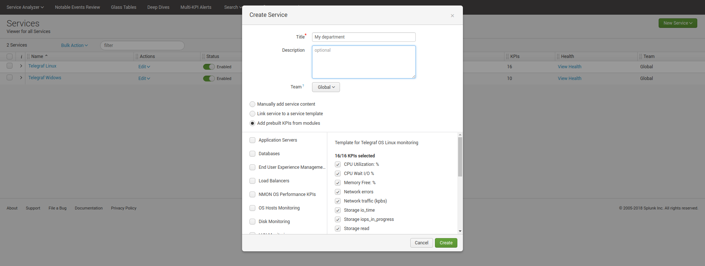
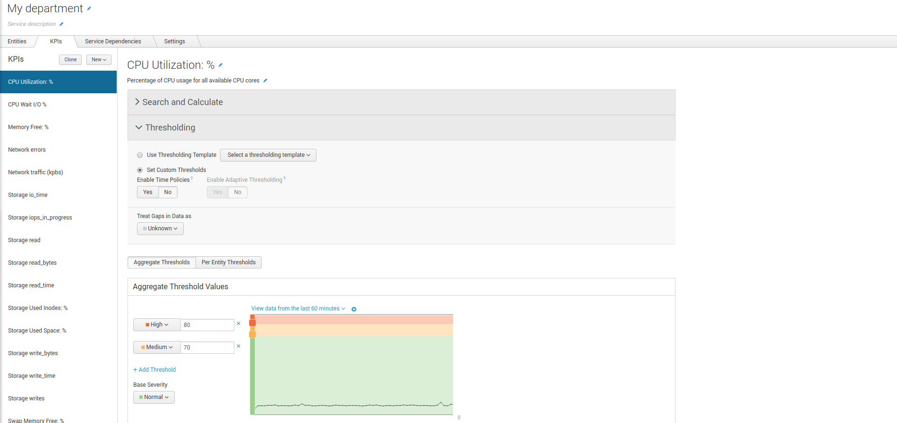
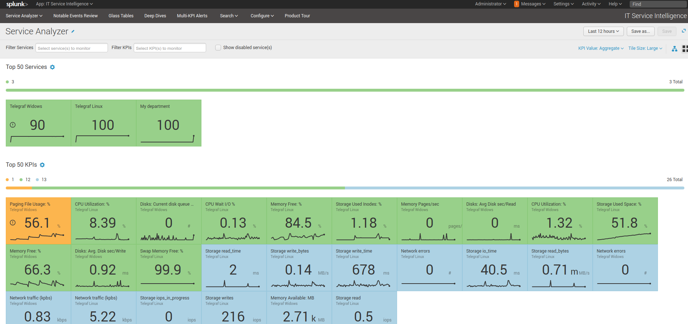
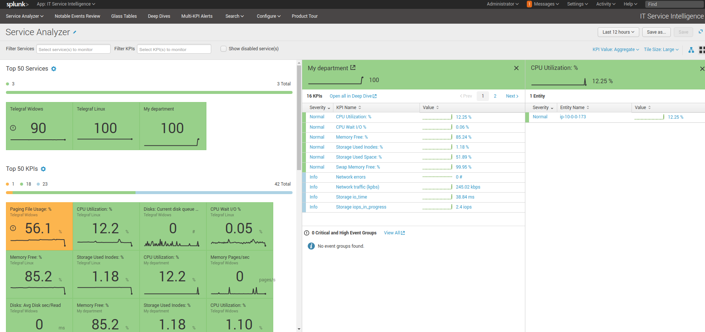
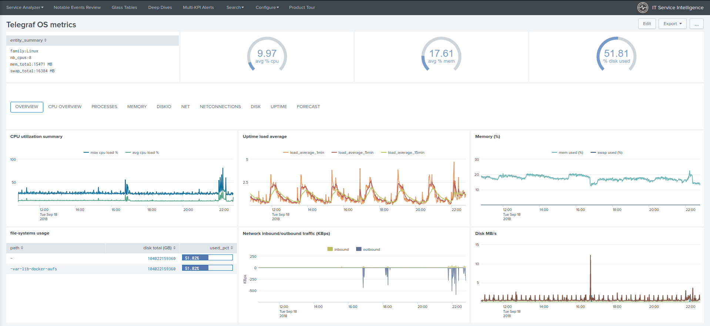

Services creation
#################

**The ITSI module for Telegraf OS provides builtin services templates, relying on several base KPIs retrieving data from the metric store.**

At the moment, the following templates are provides:

* Linux OS
* Windows OS

Creating a new service
======================

**Creating a new service and importing the KPIs definition is very easy:**

- Configure / Services / New Service / New Service

**Then fill the required information, select the option "Add prebuilt KPIs from modules", and depending on your needs:**

* Telegraf OS Monitoring (Linux)
* Telegraf OS Monitoring (Windows)

**Once the service is created, achieve any modification you need such as the hosts to be matched, customize threshold values if required, and finally activate your service.**

**After the service was created, ITSI will start to generate metrics and you service will be visible in the Service Analyser:**

**Developing the entities part of the service provides access to the entity health view:**

**Where you can access to the Telegraf OS health view:**

