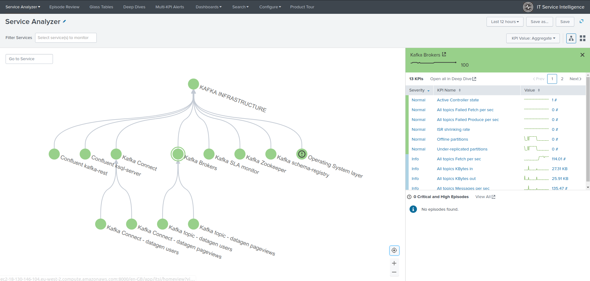
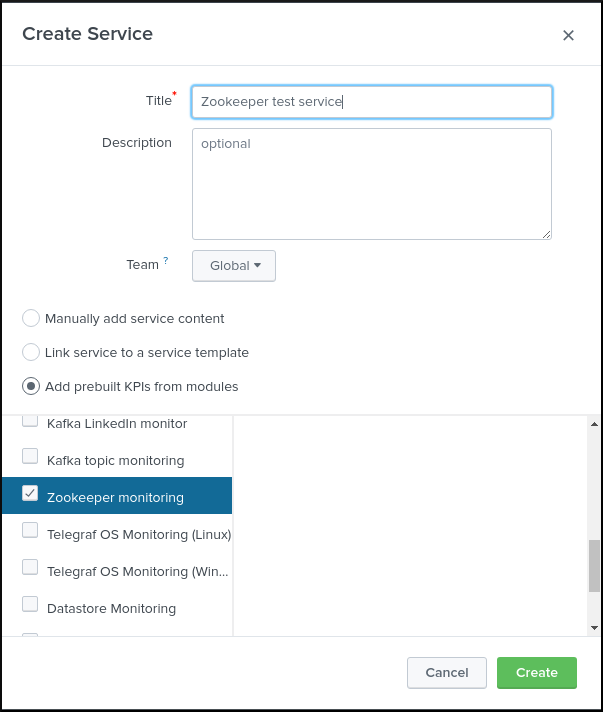
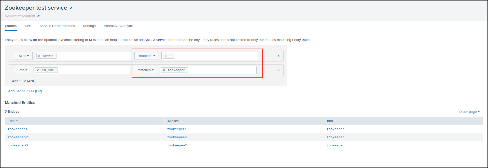
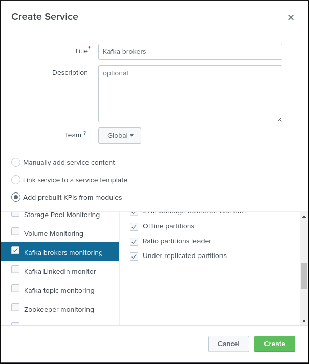
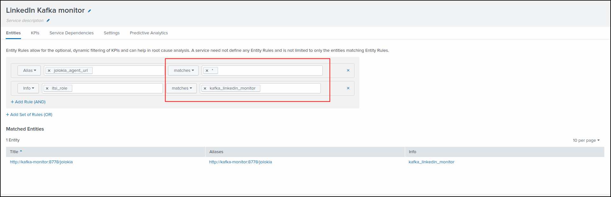

Services creation
#################

**The ITSI module for Telegraf Kafka smart monitoring provides builtin services templates, relying on several base KPIs retrieving data from the metric store.**

* **DA-ITSI-TELEGRAF-KAFKA-Zookeeper_monitoring**: provides insight monitoring for Zookeeper servers

* **DA-ITSI-TELEGRAF-KAFKA-Kafka_brokers_cluster**: provides insight monitoring for the Kafka broker infrastructure

* **DA-ITSI-TELEGRAF-KAFKA-Kafka_LinkedIn_monitor**: provides insight monitoring for the LinkedIn Kafka monitor, end to end monitoring for your Kafka deployment

* **DA-ITSI-TELEGRAF-KAFKA-Kafka_topic_monitoring**: provides insight momitoring for one or more Kafka topics

* **DA-ITSI-TELEGRAF-KAFKA-Kafka_connect**: provides insight monitoring for the Kafka connect infrastructure

**As a general practice, if you first goal is designing the IT infrastructure in ITSI, a good generic recommendation is to create a main service container for your Kafka infrastructure.**

**As such, every service that will design will be linked to the main service. (the main server depends on them)**

Monitoring Zookeeper servers
============================

**To monitor your Zookeeper servers, create a new service using the "Zookeeper monitoring" template service and select the proper filters for your entities:**

* Configure / Service / Create new service / Zookeeper monitoring

Monitoring Kafka brokers
========================

**To monitor your Zookeeper servers, create a new service using the "Kafka brokers monitoring" template service and select the proper filters for your entities:**

* Configure / Service / Create new service / Kafka brokers monitoring

.. image:: img/service_kafka_broker_pic2.png
   :alt: service_kafka_broker_pic2.png
   :align: center

Monitoring Kafka topics
=======================

**To monitor one or more Kafka topics, create a new service using the "Kafka topic monitoring" template service and select the proper filters for your entities corresponding to your topics:**

* Configure / Service / Create new service / Kafka topic monitoring

.. image:: img/service_kafka_topic_pic1.png
   :alt: service_kafka_topic_pic1.png
   :align: center

Monitoring Kafka Connect
========================

**To monitor Kafka Connect, create a new service using the "Kafka connect monitoring" template service and select the proper filters for your entities:**

* Configure / Service / Create new service / Kafka connect monitoring

.. image:: img/service_kafka_connect_pic2.png
   :alt: service_kafka_connect_pic2.png
   :align: center

End to end monitoring with LinkedIn Kafka monitor
=================================================

**To monitor your Kafka deployment using the LinkedIn Kafka monitor, create a new service using the "Kafka LinkedIn monitor" template service and select the proper filters for your entities:**

* Configure / Service / Create new service / Kafka LinkedIn monitor

