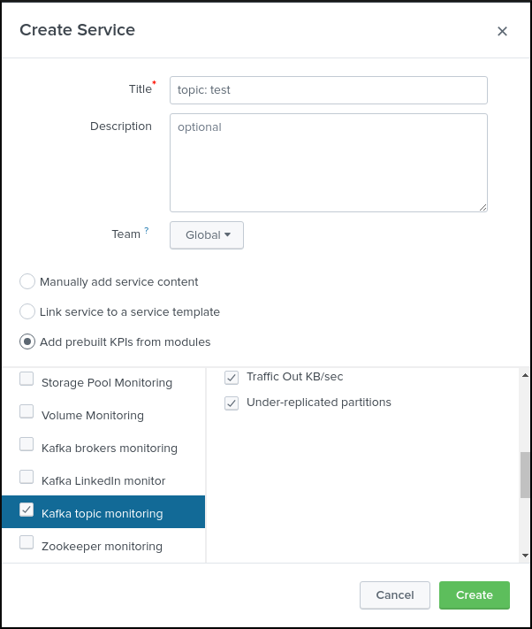
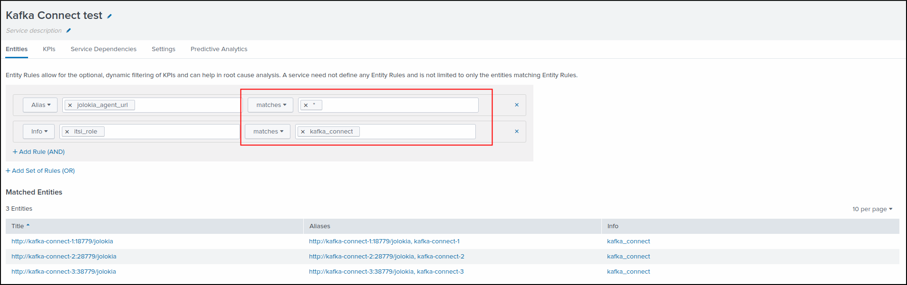
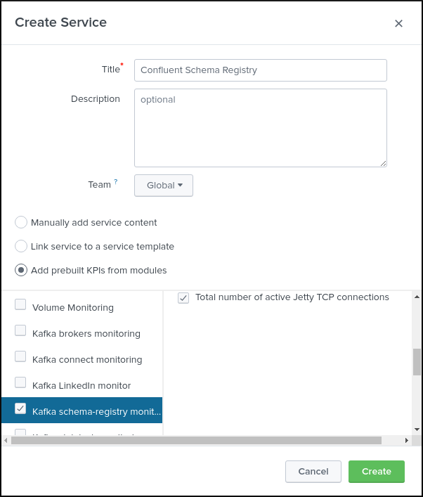

Services creation
#################

**The ITSI module for Telegraf Kafka smart monitoring provides builtin services templates, relying on several base KPIs retrieving data from the metric store.**

* **Zookeeper monitoring**

* **Kafka brokers monitoring**

* **Kafka LinkedIn monitor**

* **Kafka topic monitoring**

* **Kafka connect monitoring**

* **Kafka sink task monitoring**

* **Kafka source task monitoring**

* **Confluent schema-registry monitoring**

* **Confluent Confluent ksql-server monitoring**

* **Confluent kafka-rest monitoring**

As a general practice, if you first goal is designing the IT infrastructure in ITSI, a good generic recommendation is to create a main service container for your Kafka infrastructure.

As such, every service that will be designed will be linked to the main service. (the main service depends on them)

.. image:: img/itsi_dep.png
   :alt: itsi_dep.png
   :align: center

Monitoring Zookeeper servers
============================

**To monitor your Zookeeper servers, create a new service using the "Zookeeper monitoring" template service and select the proper filters for your entities:**

* Configure / Service / Create new service / Zookeeper monitoring

.. image:: img/service_zookeeper_pic1.png
   :alt: service_zookeeper_pic1.png
   :align: center

.. image:: img/service_zookeeper_pic2.png
   :alt: service_zookeeper_pic2.png
   :align: center

Monitoring Kafka brokers
========================

**To monitor your Zookeeper servers, create a new service using the "Kafka brokers monitoring" template service and select the proper filters for your entities:**

* Configure / Service / Create new service / Kafka brokers monitoring

.. image:: img/service_kafka_broker_pic1.png
   :alt: service_kafka_broker_pic1.png
   :align: center

Monitoring Kafka topics
=======================

**To monitor one or more Kafka topics, create a new service using the "Kafka topic monitoring" template service and select the proper filters for your entities corresponding to your topics:**

* Configure / Service / Create new service / Kafka topic monitoring

.. image:: img/service_kafka_topic_pic2.png
   :alt: service_kafka_topic_pic2.png
   :align: center

Monitoring Kafka Connect
========================

**To monitor Kafka Connect, create a new service using the "Kafka connect monitoring" template service and select the proper filters for your entities:**

* Configure / Service / Create new service / Kafka connect monitoring

.. image:: img/service_kafka_connect_pic1.png
   :alt: service_kafka_connect_pic1.png
   :align: center

Monitoring Kafka Connect Sink taks
==================================

**To monitor one of more Kafka Connect Sink connectors, create a new service using the "Kafka sink task monitoring" template service and select the proper filters for your entities:**

Monitoring Kafka Connect Source taks
====================================

**To monitor one of more Kafka Connect Source connectors, create a new service using the "Kafka source task monitoring" template service and select the proper filters for your entities:**

Monitoring Confluent schema-registry
====================================

**To monitor one of more Confluent schema-registry nodes, create a new service using the "Kafka schema-registry monitoring" template service and select the proper filters for your entities:**

.. image:: img/service_confluent_schema_registry_pic2.png
   :alt: service_confluent_schema_registry_pic2.png
   :align: center

End to end monitoring with LinkedIn Kafka monitor
=================================================

**To monitor your Kafka deployment using the LinkedIn Kafka monitor, create a new service using the "Kafka LinkedIn monitor" template service and select the proper filters for your entities:**

* Configure / Service / Create new service / Kafka LinkedIn monitor

.. image:: img/service_kafka_monitor_pic1.png
   :alt: service_kafka_monitor_pic1.png
   :align: center

.. image:: img/service_kafka_monitor_pic2.png
   :alt: service_kafka_monitor_pic2.png
   :align: center
